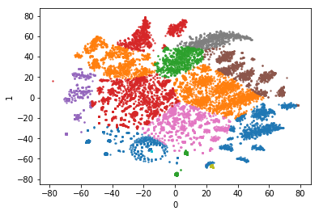
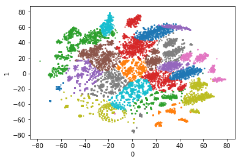
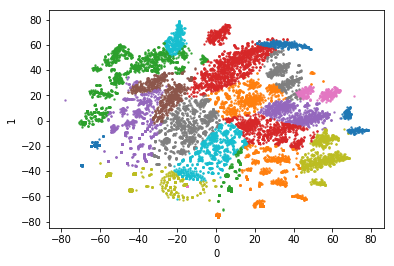

```python
import numpy as np
import pandas as pd
import matplotlib.pyplot as plt
import seaborn as sns

from scipy.stats import pearsonr
from sklearn.decomposition import PCA, KernelPCA
from sklearn.preprocessing import RobustScaler
from sklearn.manifold import TSNE
from sklearn.mixture import GaussianMixture, BayesianGaussianMixture
```


```python
df= pd.read_pickle('./pkl_result/item_selected_by_middleline.pkl')
```


```python
df_raw= pd.read_table('./Pre_processed_data/merged_dataframe_shopping.csv', delimiter= ',', encoding='euc-kr')
```


```python
df_feature= pd.read_pickle('./pkl_result/features_by_middleline.pkl')
```


```python
df.head()
```


<div>
<style scoped>
    .dataframe tbody tr th:only-of-type {
        vertical-align: middle;
    }

    .dataframe tbody tr th {
        vertical-align: top;
    }

    .dataframe thead th {
        text-align: right;
    }
</style>
<table border="1" class="dataframe">
  <thead>
    <tr style="text-align: right;">
      <th></th>
      <th>H&amp;B선물세트</th>
      <th>VIDEOGAME</th>
      <th>가공식품</th>
      <th>가공우유</th>
      <th>가구</th>
      <th>가방브랜드</th>
      <th>계절완구</th>
      <th>고급</th>
      <th>고양이용품</th>
      <th>골프</th>
      <th>...</th>
      <th>필기용품</th>
      <th>한방차</th>
      <th>한우선물세트</th>
      <th>해초</th>
      <th>헬스용품</th>
      <th>호주산소고기</th>
      <th>홍인삼</th>
      <th>화과자</th>
      <th>황태</th>
      <th>훼이셜케어</th>
    </tr>
    <tr>
      <th>ID</th>
      <th></th>
      <th></th>
      <th></th>
      <th></th>
      <th></th>
      <th></th>
      <th></th>
      <th></th>
      <th></th>
      <th></th>
      <th></th>
      <th></th>
      <th></th>
      <th></th>
      <th></th>
      <th></th>
      <th></th>
      <th></th>
      <th></th>
      <th></th>
      <th></th>
    </tr>
  </thead>
  <tbody>
    <tr>
      <th>1</th>
      <td>0.0</td>
      <td>0.0</td>
      <td>10.0</td>
      <td>0.0</td>
      <td>0.0</td>
      <td>0.0</td>
      <td>0.0</td>
      <td>0.0</td>
      <td>0.0</td>
      <td>0.0</td>
      <td>...</td>
      <td>0.0</td>
      <td>0.0</td>
      <td>0.0</td>
      <td>0.0</td>
      <td>0.0</td>
      <td>0.0</td>
      <td>0.0</td>
      <td>0.0</td>
      <td>0.0</td>
      <td>0.0</td>
    </tr>
    <tr>
      <th>2</th>
      <td>0.0</td>
      <td>0.0</td>
      <td>6.0</td>
      <td>1.0</td>
      <td>0.0</td>
      <td>0.0</td>
      <td>0.0</td>
      <td>0.0</td>
      <td>0.0</td>
      <td>0.0</td>
      <td>...</td>
      <td>0.0</td>
      <td>0.0</td>
      <td>0.0</td>
      <td>0.0</td>
      <td>0.0</td>
      <td>0.0</td>
      <td>0.0</td>
      <td>0.0</td>
      <td>0.0</td>
      <td>0.0</td>
    </tr>
    <tr>
      <th>3</th>
      <td>0.0</td>
      <td>0.0</td>
      <td>3.0</td>
      <td>0.0</td>
      <td>0.0</td>
      <td>0.0</td>
      <td>0.0</td>
      <td>0.0</td>
      <td>0.0</td>
      <td>0.0</td>
      <td>...</td>
      <td>0.0</td>
      <td>0.0</td>
      <td>0.0</td>
      <td>0.0</td>
      <td>0.0</td>
      <td>4.0</td>
      <td>0.0</td>
      <td>0.0</td>
      <td>0.0</td>
      <td>0.0</td>
    </tr>
    <tr>
      <th>4</th>
      <td>0.0</td>
      <td>0.0</td>
      <td>38.0</td>
      <td>0.0</td>
      <td>0.0</td>
      <td>0.0</td>
      <td>0.0</td>
      <td>0.0</td>
      <td>0.0</td>
      <td>1.0</td>
      <td>...</td>
      <td>0.0</td>
      <td>0.0</td>
      <td>0.0</td>
      <td>0.0</td>
      <td>0.0</td>
      <td>0.0</td>
      <td>0.0</td>
      <td>0.0</td>
      <td>0.0</td>
      <td>0.0</td>
    </tr>
    <tr>
      <th>6</th>
      <td>0.0</td>
      <td>0.0</td>
      <td>2.0</td>
      <td>0.0</td>
      <td>0.0</td>
      <td>0.0</td>
      <td>0.0</td>
      <td>0.0</td>
      <td>0.0</td>
      <td>0.0</td>
      <td>...</td>
      <td>0.0</td>
      <td>0.0</td>
      <td>0.0</td>
      <td>0.0</td>
      <td>0.0</td>
      <td>14.0</td>
      <td>0.0</td>
      <td>1.0</td>
      <td>0.0</td>
      <td>0.0</td>
    </tr>
  </tbody>
</table>
<p>5 rows × 149 columns</p>
</div>


```python
df_feature.head()
```


<div>
<style scoped>
    .dataframe tbody tr th:only-of-type {
        vertical-align: middle;
    }

    .dataframe tbody tr th {
        vertical-align: top;
    }

    .dataframe thead th {
        text-align: right;
    }
</style>
<table border="1" class="dataframe">
  <thead>
    <tr style="text-align: right;">
      <th></th>
      <th>PD_H_NM</th>
      <th>PD_M_NM</th>
    </tr>
  </thead>
  <tbody>
    <tr>
      <th>6</th>
      <td>식품</td>
      <td>가공식품</td>
    </tr>
    <tr>
      <th>20</th>
      <td>잡화</td>
      <td>피혁잡화</td>
    </tr>
    <tr>
      <th>43</th>
      <td>남성의류</td>
      <td>남성정장</td>
    </tr>
    <tr>
      <th>95</th>
      <td>스포츠</td>
      <td>골프용품</td>
    </tr>
    <tr>
      <th>109</th>
      <td>여성의류</td>
      <td>시티웨어</td>
    </tr>
  </tbody>
</table>
</div>


```python
data_scaled= pd.DataFrame(RobustScaler().fit_transform(df), columns= df.columns)
```


```python
data_scaled.head()
```


<div>
<style scoped>
    .dataframe tbody tr th:only-of-type {
        vertical-align: middle;
    }

    .dataframe tbody tr th {
        vertical-align: top;
    }

    .dataframe thead th {
        text-align: right;
    }
</style>
<table border="1" class="dataframe">
  <thead>
    <tr style="text-align: right;">
      <th></th>
      <th>H&amp;B선물세트</th>
      <th>VIDEOGAME</th>
      <th>가공식품</th>
      <th>가공우유</th>
      <th>가구</th>
      <th>가방브랜드</th>
      <th>계절완구</th>
      <th>고급</th>
      <th>고양이용품</th>
      <th>골프</th>
      <th>...</th>
      <th>필기용품</th>
      <th>한방차</th>
      <th>한우선물세트</th>
      <th>해초</th>
      <th>헬스용품</th>
      <th>호주산소고기</th>
      <th>홍인삼</th>
      <th>화과자</th>
      <th>황태</th>
      <th>훼이셜케어</th>
    </tr>
  </thead>
  <tbody>
    <tr>
      <th>0</th>
      <td>0.0</td>
      <td>0.0</td>
      <td>0.400000</td>
      <td>0.0</td>
      <td>0.0</td>
      <td>0.0</td>
      <td>0.0</td>
      <td>0.0</td>
      <td>0.0</td>
      <td>0.0</td>
      <td>...</td>
      <td>0.0</td>
      <td>0.0</td>
      <td>0.0</td>
      <td>0.0</td>
      <td>0.0</td>
      <td>0.0</td>
      <td>0.0</td>
      <td>0.0</td>
      <td>0.0</td>
      <td>0.0</td>
    </tr>
    <tr>
      <th>1</th>
      <td>0.0</td>
      <td>0.0</td>
      <td>0.133333</td>
      <td>1.0</td>
      <td>0.0</td>
      <td>0.0</td>
      <td>0.0</td>
      <td>0.0</td>
      <td>0.0</td>
      <td>0.0</td>
      <td>...</td>
      <td>0.0</td>
      <td>0.0</td>
      <td>0.0</td>
      <td>0.0</td>
      <td>0.0</td>
      <td>0.0</td>
      <td>0.0</td>
      <td>0.0</td>
      <td>0.0</td>
      <td>0.0</td>
    </tr>
    <tr>
      <th>2</th>
      <td>0.0</td>
      <td>0.0</td>
      <td>-0.066667</td>
      <td>0.0</td>
      <td>0.0</td>
      <td>0.0</td>
      <td>0.0</td>
      <td>0.0</td>
      <td>0.0</td>
      <td>0.0</td>
      <td>...</td>
      <td>0.0</td>
      <td>0.0</td>
      <td>0.0</td>
      <td>0.0</td>
      <td>0.0</td>
      <td>4.0</td>
      <td>0.0</td>
      <td>0.0</td>
      <td>0.0</td>
      <td>0.0</td>
    </tr>
    <tr>
      <th>3</th>
      <td>0.0</td>
      <td>0.0</td>
      <td>2.266667</td>
      <td>0.0</td>
      <td>0.0</td>
      <td>0.0</td>
      <td>0.0</td>
      <td>0.0</td>
      <td>0.0</td>
      <td>1.0</td>
      <td>...</td>
      <td>0.0</td>
      <td>0.0</td>
      <td>0.0</td>
      <td>0.0</td>
      <td>0.0</td>
      <td>0.0</td>
      <td>0.0</td>
      <td>0.0</td>
      <td>0.0</td>
      <td>0.0</td>
    </tr>
    <tr>
      <th>4</th>
      <td>0.0</td>
      <td>0.0</td>
      <td>-0.133333</td>
      <td>0.0</td>
      <td>0.0</td>
      <td>0.0</td>
      <td>0.0</td>
      <td>0.0</td>
      <td>0.0</td>
      <td>0.0</td>
      <td>...</td>
      <td>0.0</td>
      <td>0.0</td>
      <td>0.0</td>
      <td>0.0</td>
      <td>0.0</td>
      <td>14.0</td>
      <td>0.0</td>
      <td>1.0</td>
      <td>0.0</td>
      <td>0.0</td>
    </tr>
  </tbody>
</table>
<p>5 rows × 149 columns</p>
</div>


```python
data_tsne= {}
label_dict= {}
gmm_dict= {}
```


```python
result_dict= {}
```


```python
data_tsne[(2, 30)]= TSNE(n_components= 2, init= 'random', random_state= 42, perplexity= 30).fit_transform(data_scaled)
```


```python
data_tsne[(2, 30)]= pd.DataFrame(data_tsne[(2, 30)])
```


```python
def plot_results(X, Y_= None):
    if Y_.any():
        for i in range(Y_.nunique()):
            grp= sns.regplot(x= X[Y_==i].iloc[:,0], y= X[Y_==i].iloc[:, 1], fit_reg= False, scatter_kws= {'s': 2})
        plt.show()
    else:
        grp= sns.regplot(x= X.iloc[:,0], y= X.iloc[:, 1], fit_reg= False, scatter_kws= {'s': 2})
        plt.show()
```


```python
for i_tuple, data in data_tsne.items():
    print(i_tuple)
    data
    data.head()
    data.to_pickle('./pkl_result/data_tSNE_dim{i_tuple[0]}_perplex{i_tuple[1]}.pkl'.format(i_tuple= i_tuple))
```

    (2, 30)
    


```python
data_tsne[(2,30)]= pd.read_pickle('./pkl_result/data_tSNE_dim2_perplex30.pkl')
```


```python
for i in range(10, 41, 2):
    gmm = GaussianMixture(n_components=i, covariance_type='full', random_state= 42).fit(data_tsne[(2, 30)])
    label_dict[(2,i)]= pd.Series(gmm.predict(data_tsne[(2, 30)]))
    plot_results(data_tsne[(2,30)], label_dict[(2,i)])
```


```python
gmm_14clst = GaussianMixture(n_components=14, covariance_type='full', random_state= 42).fit(data_tsne[(2, 30)])
label_dict[(2,14)]= pd.Series(gmm_14clst.predict(data_tsne[(2, 30)]))
plot_results(data_tsne[(2,30)], label_dict[(2,14)])
gmm_28clst = GaussianMixture(n_components=28, covariance_type='full', random_state= 42).fit(data_tsne[(2, 30)])
label_dict[(2,28)]= pd.Series(gmm_28clst.predict(data_tsne[(2, 30)]))
plot_results(data_tsne[(2,30)], label_dict[(2,28)])
gmm_24clst = GaussianMixture(n_components=24, tol= 1e-4, max_iter= 500, covariance_type='full', random_state= 42).fit(data_tsne[(2, 30)])
label_dict[(2,24)]= pd.Series(gmm_24clst.predict(data_tsne[(2, 30)]))
plot_results(data_tsne[(2,30)], label_dict[(2, 24)])
```











```python
for i_tuple, data in data_tsne.items():
    print(i_tuple)
    for key, label in label_dict.items():
        if key[0]== i_tuple[0]:
            label.name= 'y_{}_clst'.format(key[1])
            data= pd.concat([data, label], axis= 1)
    data.info()
    result_dict[i_tuple]= data
    data.to_pickle('./pkl_result/data_tSNE_dim{i_tuple[0]}_perplex{i_tuple[1]}.pkl'.format(i_tuple= i_tuple))
```

    (2, 30)
    <class 'pandas.core.frame.DataFrame'>
    RangeIndex: 18550 entries, 0 to 18549
    Data columns (total 5 columns):
    0            18550 non-null float32
    1            18550 non-null float32
    y_14_clst    18550 non-null int64
    y_28_clst    18550 non-null int64
    y_24_clst    18550 non-null int64
    dtypes: float32(2), int64(3)
    memory usage: 579.8 KB
    


```python
result_dict[(2,30)].head()
```


<div>
<style scoped>
    .dataframe tbody tr th:only-of-type {
        vertical-align: middle;
    }

    .dataframe tbody tr th {
        vertical-align: top;
    }

    .dataframe thead th {
        text-align: right;
    }
</style>
<table border="1" class="dataframe">
  <thead>
    <tr style="text-align: right;">
      <th></th>
      <th>0</th>
      <th>1</th>
      <th>y_14_clst</th>
      <th>y_28_clst</th>
      <th>y_24_clst</th>
    </tr>
  </thead>
  <tbody>
    <tr>
      <th>0</th>
      <td>-25.339636</td>
      <td>54.876450</td>
      <td>3</td>
      <td>9</td>
      <td>9</td>
    </tr>
    <tr>
      <th>1</th>
      <td>53.016911</td>
      <td>-32.975819</td>
      <td>10</td>
      <td>8</td>
      <td>8</td>
    </tr>
    <tr>
      <th>2</th>
      <td>-22.183092</td>
      <td>52.640892</td>
      <td>3</td>
      <td>9</td>
      <td>9</td>
    </tr>
    <tr>
      <th>3</th>
      <td>37.014935</td>
      <td>7.398327</td>
      <td>1</td>
      <td>4</td>
      <td>4</td>
    </tr>
    <tr>
      <th>4</th>
      <td>42.187847</td>
      <td>32.573856</td>
      <td>5</td>
      <td>17</td>
      <td>17</td>
    </tr>
  </tbody>
</table>
</div>


