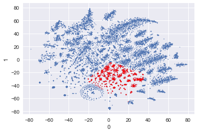
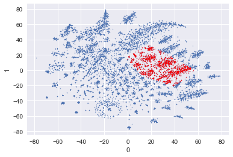
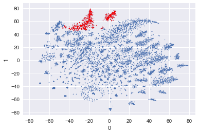
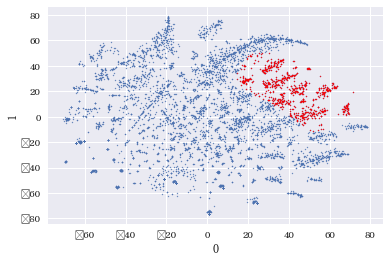
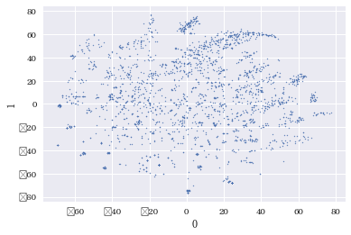
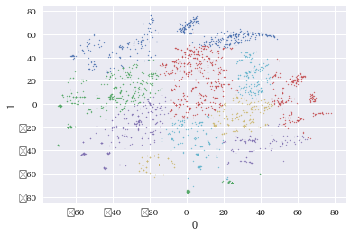
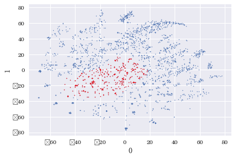

```python
import numpy as np
import pandas as pd
import seaborn as sns
import matplotlib
import matplotlib.pyplot as plt
import pickle as pkl

from scipy.stats import ttest_ind
from sklearn.preprocessing import RobustScaler
from sklearn.manifold import TSNE
from sklearn.mixture import GaussianMixture

font= matplotlib.font_manager.FontProperties(fname= 'C:\Windows\\Fonts\\BareunBatangL.ttf').get_name()
matplotlib.rc('font', family=font)  
```


```python
df_bymonth= pd.read_csv('./Pre_processed_data/groupby_ID_YEARMONTH.csv')
```


```python
df_bymonth.head()
```


<div>
<style scoped>
    .dataframe tbody tr th:only-of-type {
        vertical-align: middle;
    }

    .dataframe tbody tr th {
        vertical-align: top;
    }

    .dataframe thead th {
        text-align: right;
    }
</style>
<table border="1" class="dataframe">
  <thead>
    <tr style="text-align: right;">
      <th></th>
      <th>ID</th>
      <th>YEARMONTH</th>
      <th>RCT_NO</th>
      <th>PD_S_C</th>
      <th>DAYHOUR</th>
      <th>BUY_AM</th>
      <th>BIZ_UNIT_A01</th>
      <th>BIZ_UNIT_A02</th>
      <th>BIZ_UNIT_A03</th>
      <th>BIZ_UNIT_A04</th>
      <th>BIZ_UNIT_A05</th>
    </tr>
  </thead>
  <tbody>
    <tr>
      <th>0</th>
      <td>1</td>
      <td>201501</td>
      <td>4</td>
      <td>4</td>
      <td>2</td>
      <td>105800</td>
      <td>4.0</td>
      <td>0.0</td>
      <td>0.0</td>
      <td>0.0</td>
      <td>0</td>
    </tr>
    <tr>
      <th>1</th>
      <td>1</td>
      <td>201503</td>
      <td>4</td>
      <td>4</td>
      <td>2</td>
      <td>733900</td>
      <td>4.0</td>
      <td>0.0</td>
      <td>0.0</td>
      <td>0.0</td>
      <td>0</td>
    </tr>
    <tr>
      <th>2</th>
      <td>1</td>
      <td>201504</td>
      <td>1</td>
      <td>1</td>
      <td>1</td>
      <td>13000</td>
      <td>1.0</td>
      <td>0.0</td>
      <td>0.0</td>
      <td>0.0</td>
      <td>0</td>
    </tr>
    <tr>
      <th>3</th>
      <td>1</td>
      <td>201505</td>
      <td>12</td>
      <td>9</td>
      <td>4</td>
      <td>434230</td>
      <td>11.0</td>
      <td>1.0</td>
      <td>0.0</td>
      <td>0.0</td>
      <td>0</td>
    </tr>
    <tr>
      <th>4</th>
      <td>1</td>
      <td>201506</td>
      <td>9</td>
      <td>6</td>
      <td>4</td>
      <td>579000</td>
      <td>9.0</td>
      <td>0.0</td>
      <td>0.0</td>
      <td>0.0</td>
      <td>0</td>
    </tr>
  </tbody>
</table>
</div>


```python
pt_bytsne= pd.read_pickle('./pkl_result/data_tSNE_dim2_perplex30.pkl')
```


```python
pt_bytsne.head()
```


<div>
<style scoped>
    .dataframe tbody tr th:only-of-type {
        vertical-align: middle;
    }

    .dataframe tbody tr th {
        vertical-align: top;
    }

    .dataframe thead th {
        text-align: right;
    }
</style>
<table border="1" class="dataframe">
  <thead>
    <tr style="text-align: right;">
      <th></th>
      <th>0</th>
      <th>1</th>
      <th>y_14_clst</th>
      <th>y_28_clst</th>
      <th>y_24_clst</th>
    </tr>
  </thead>
  <tbody>
    <tr>
      <th>0</th>
      <td>-25.339636</td>
      <td>54.876450</td>
      <td>3</td>
      <td>9</td>
      <td>9</td>
    </tr>
    <tr>
      <th>1</th>
      <td>53.016911</td>
      <td>-32.975819</td>
      <td>10</td>
      <td>8</td>
      <td>8</td>
    </tr>
    <tr>
      <th>2</th>
      <td>-22.183092</td>
      <td>52.640892</td>
      <td>3</td>
      <td>9</td>
      <td>9</td>
    </tr>
    <tr>
      <th>3</th>
      <td>37.014935</td>
      <td>7.398327</td>
      <td>1</td>
      <td>4</td>
      <td>4</td>
    </tr>
    <tr>
      <th>4</th>
      <td>42.187847</td>
      <td>32.573856</td>
      <td>5</td>
      <td>17</td>
      <td>17</td>
    </tr>
  </tbody>
</table>
</div>


```python
pt_bytsne.info()
```

    <class 'pandas.core.frame.DataFrame'>
    RangeIndex: 18550 entries, 0 to 18549
    Data columns (total 5 columns):
    0            18550 non-null float32
    1            18550 non-null float32
    y_14_clst    18550 non-null int64
    y_28_clst    18550 non-null int64
    y_24_clst    18550 non-null int64
    dtypes: float32(2), int64(3)
    memory usage: 579.8 KB
    


```python
df_raw= pd.read_csv('./Pre_processed_data/merged_dataframe_shopping.csv', delimiter= ',', encoding= 'euc-kr')
```


```python
df_raw.head()
```


<div>
<style scoped>
    .dataframe tbody tr th:only-of-type {
        vertical-align: middle;
    }

    .dataframe tbody tr th {
        vertical-align: top;
    }

    .dataframe thead th {
        text-align: right;
    }
</style>
<table border="1" class="dataframe">
  <thead>
    <tr style="text-align: right;">
      <th></th>
      <th>Unnamed: 0</th>
      <th>ID</th>
      <th>RCT_NO</th>
      <th>BIZ_UNIT</th>
      <th>PD_S_C</th>
      <th>BR_C</th>
      <th>BUY_AM</th>
      <th>BUY_CT</th>
      <th>AGE_PRD</th>
      <th>HOM_PST_NO</th>
      <th>...</th>
      <th>PD_M_NM</th>
      <th>PD_H_NM</th>
      <th>IS_MALE</th>
      <th>IS_FEMALE</th>
      <th>YEAR</th>
      <th>MONTH</th>
      <th>DAY</th>
      <th>HOUR</th>
      <th>PRVIN</th>
      <th>DESTRICT</th>
    </tr>
  </thead>
  <tbody>
    <tr>
      <th>0</th>
      <td>0</td>
      <td>4008</td>
      <td>2108</td>
      <td>A01</td>
      <td>215</td>
      <td>2</td>
      <td>59600</td>
      <td>2</td>
      <td>50</td>
      <td>056</td>
      <td>...</td>
      <td>캐주얼</td>
      <td>여성의류</td>
      <td>0</td>
      <td>1</td>
      <td>2015</td>
      <td>2</td>
      <td>16</td>
      <td>13</td>
      <td>서울특별시</td>
      <td>송파구</td>
    </tr>
    <tr>
      <th>1</th>
      <td>1</td>
      <td>6379</td>
      <td>2109</td>
      <td>A01</td>
      <td>75</td>
      <td>29</td>
      <td>35000</td>
      <td>1</td>
      <td>40</td>
      <td>480</td>
      <td>...</td>
      <td>건강식품</td>
      <td>식품</td>
      <td>1</td>
      <td>0</td>
      <td>2015</td>
      <td>2</td>
      <td>13</td>
      <td>11</td>
      <td>부산광역시</td>
      <td>해운대구</td>
    </tr>
    <tr>
      <th>2</th>
      <td>2</td>
      <td>6379</td>
      <td>2109</td>
      <td>A01</td>
      <td>149</td>
      <td>4</td>
      <td>85000</td>
      <td>1</td>
      <td>40</td>
      <td>480</td>
      <td>...</td>
      <td>화장품</td>
      <td>잡화</td>
      <td>1</td>
      <td>0</td>
      <td>2015</td>
      <td>1</td>
      <td>15</td>
      <td>10</td>
      <td>부산광역시</td>
      <td>해운대구</td>
    </tr>
    <tr>
      <th>3</th>
      <td>3</td>
      <td>8002</td>
      <td>2110</td>
      <td>A01</td>
      <td>138</td>
      <td>10</td>
      <td>25000</td>
      <td>1</td>
      <td>30</td>
      <td>300</td>
      <td>...</td>
      <td>섬유잡화</td>
      <td>잡화</td>
      <td>0</td>
      <td>1</td>
      <td>2015</td>
      <td>12</td>
      <td>20</td>
      <td>10</td>
      <td>세종특별자치시</td>
      <td>NaN</td>
    </tr>
    <tr>
      <th>4</th>
      <td>4</td>
      <td>8002</td>
      <td>2110</td>
      <td>A01</td>
      <td>138</td>
      <td>10</td>
      <td>21000</td>
      <td>1</td>
      <td>30</td>
      <td>300</td>
      <td>...</td>
      <td>섬유잡화</td>
      <td>잡화</td>
      <td>0</td>
      <td>1</td>
      <td>2015</td>
      <td>12</td>
      <td>20</td>
      <td>10</td>
      <td>세종특별자치시</td>
      <td>NaN</td>
    </tr>
  </tbody>
</table>
<p>5 rows × 21 columns</p>
</div>


```python
df_grouped= df_raw.sort_values('ID')
```


```python
agg_func= {'RCT_NO': 'count', 'BIZ_UNIT': lambda x: x.nunique(), 'PD_S_C': lambda x: x.nunique(), \
           'BR_C': lambda x: x.nunique(), 'BUY_AM': 'sum'}
```


```python
df_grouped= df_grouped.groupby('ID').agg(agg_func).reset_index(drop= False)
```


```python
df_grouped.head()
```


<div>
<style scoped>
    .dataframe tbody tr th:only-of-type {
        vertical-align: middle;
    }

    .dataframe tbody tr th {
        vertical-align: top;
    }

    .dataframe thead th {
        text-align: right;
    }
</style>
<table border="1" class="dataframe">
  <thead>
    <tr style="text-align: right;">
      <th></th>
      <th>ID</th>
      <th>RCT_NO</th>
      <th>BIZ_UNIT</th>
      <th>PD_S_C</th>
      <th>BR_C</th>
      <th>BUY_AM</th>
    </tr>
  </thead>
  <tbody>
    <tr>
      <th>0</th>
      <td>1</td>
      <td>55</td>
      <td>2</td>
      <td>33</td>
      <td>3</td>
      <td>3695930</td>
    </tr>
    <tr>
      <th>1</th>
      <td>2</td>
      <td>259</td>
      <td>2</td>
      <td>111</td>
      <td>3</td>
      <td>1979142</td>
    </tr>
    <tr>
      <th>2</th>
      <td>3</td>
      <td>109</td>
      <td>3</td>
      <td>61</td>
      <td>7</td>
      <td>2272884</td>
    </tr>
    <tr>
      <th>3</th>
      <td>4</td>
      <td>308</td>
      <td>3</td>
      <td>136</td>
      <td>7</td>
      <td>7970116</td>
    </tr>
    <tr>
      <th>4</th>
      <td>6</td>
      <td>946</td>
      <td>4</td>
      <td>253</td>
      <td>9</td>
      <td>6458914</td>
    </tr>
  </tbody>
</table>
</div>


```python
df_demo= df_demo[['ID', 'AGE_PRD', 'IS_MALE', 'IS_FEMALE', 'PRVIN']].drop_duplicates(subset= 'ID').sort_values('ID').reset_index(drop= True)
```


```python
df_demo.head(10)
```


<div>
<style scoped>
    .dataframe tbody tr th:only-of-type {
        vertical-align: middle;
    }

    .dataframe tbody tr th {
        vertical-align: top;
    }

    .dataframe thead th {
        text-align: right;
    }
</style>
<table border="1" class="dataframe">
  <thead>
    <tr style="text-align: right;">
      <th></th>
      <th>ID</th>
      <th>AGE_PRD</th>
      <th>IS_MALE</th>
      <th>IS_FEMALE</th>
      <th>PRVIN</th>
    </tr>
  </thead>
  <tbody>
    <tr>
      <th>0</th>
      <td>1</td>
      <td>60</td>
      <td>1</td>
      <td>0</td>
      <td>서울특별시</td>
    </tr>
    <tr>
      <th>1</th>
      <td>2</td>
      <td>60</td>
      <td>0</td>
      <td>1</td>
      <td>서울특별시</td>
    </tr>
    <tr>
      <th>2</th>
      <td>3</td>
      <td>60</td>
      <td>0</td>
      <td>1</td>
      <td>광주광역시</td>
    </tr>
    <tr>
      <th>3</th>
      <td>4</td>
      <td>60</td>
      <td>1</td>
      <td>0</td>
      <td>경기도</td>
    </tr>
    <tr>
      <th>4</th>
      <td>6</td>
      <td>60</td>
      <td>0</td>
      <td>1</td>
      <td>서울특별시</td>
    </tr>
    <tr>
      <th>5</th>
      <td>7</td>
      <td>60</td>
      <td>0</td>
      <td>1</td>
      <td>서울특별시</td>
    </tr>
    <tr>
      <th>6</th>
      <td>8</td>
      <td>60</td>
      <td>0</td>
      <td>1</td>
      <td>부산광역시</td>
    </tr>
    <tr>
      <th>7</th>
      <td>9</td>
      <td>60</td>
      <td>0</td>
      <td>1</td>
      <td>부산광역시</td>
    </tr>
    <tr>
      <th>8</th>
      <td>10</td>
      <td>60</td>
      <td>1</td>
      <td>0</td>
      <td>서울특별시</td>
    </tr>
    <tr>
      <th>9</th>
      <td>11</td>
      <td>60</td>
      <td>1</td>
      <td>0</td>
      <td>서울특별시</td>
    </tr>
  </tbody>
</table>
</div>


```python
df_bymonth.sort_values('RCT_NO', ascending=False).head(30)
```


<div>
<style scoped>
    .dataframe tbody tr th:only-of-type {
        vertical-align: middle;
    }

    .dataframe tbody tr th {
        vertical-align: top;
    }

    .dataframe thead th {
        text-align: right;
    }
</style>
<table border="1" class="dataframe">
  <thead>
    <tr style="text-align: right;">
      <th></th>
      <th>ID</th>
      <th>YEARMONTH</th>
      <th>RCT_NO</th>
      <th>PD_S_C</th>
      <th>DAYHOUR</th>
      <th>BUY_AM</th>
      <th>BIZ_UNIT_A01</th>
      <th>BIZ_UNIT_A02</th>
      <th>BIZ_UNIT_A03</th>
      <th>BIZ_UNIT_A04</th>
      <th>BIZ_UNIT_A05</th>
    </tr>
  </thead>
  <tbody>
    <tr>
      <th>64952</th>
      <td>7089</td>
      <td>201504</td>
      <td>2382</td>
      <td>216</td>
      <td>22</td>
      <td>48105844</td>
      <td>6.0</td>
      <td>102.0</td>
      <td>0.0</td>
      <td>2274.0</td>
      <td>0</td>
    </tr>
    <tr>
      <th>88487</th>
      <td>9782</td>
      <td>201512</td>
      <td>774</td>
      <td>118</td>
      <td>68</td>
      <td>1925660</td>
      <td>0.0</td>
      <td>0.0</td>
      <td>0.0</td>
      <td>774.0</td>
      <td>0</td>
    </tr>
    <tr>
      <th>138520</th>
      <td>16742</td>
      <td>201509</td>
      <td>742</td>
      <td>139</td>
      <td>86</td>
      <td>1900350</td>
      <td>0.0</td>
      <td>0.0</td>
      <td>0.0</td>
      <td>742.0</td>
      <td>0</td>
    </tr>
    <tr>
      <th>138517</th>
      <td>16742</td>
      <td>201506</td>
      <td>733</td>
      <td>141</td>
      <td>108</td>
      <td>1910200</td>
      <td>0.0</td>
      <td>0.0</td>
      <td>0.0</td>
      <td>733.0</td>
      <td>0</td>
    </tr>
    <tr>
      <th>138518</th>
      <td>16742</td>
      <td>201507</td>
      <td>649</td>
      <td>126</td>
      <td>100</td>
      <td>1562540</td>
      <td>0.0</td>
      <td>0.0</td>
      <td>0.0</td>
      <td>649.0</td>
      <td>0</td>
    </tr>
    <tr>
      <th>138519</th>
      <td>16742</td>
      <td>201508</td>
      <td>559</td>
      <td>123</td>
      <td>71</td>
      <td>1238710</td>
      <td>0.0</td>
      <td>0.0</td>
      <td>0.0</td>
      <td>559.0</td>
      <td>0</td>
    </tr>
    <tr>
      <th>5651</th>
      <td>611</td>
      <td>201506</td>
      <td>534</td>
      <td>80</td>
      <td>52</td>
      <td>16560710</td>
      <td>456.0</td>
      <td>78.0</td>
      <td>0.0</td>
      <td>0.0</td>
      <td>0</td>
    </tr>
    <tr>
      <th>138521</th>
      <td>16742</td>
      <td>201510</td>
      <td>526</td>
      <td>116</td>
      <td>85</td>
      <td>1265700</td>
      <td>0.0</td>
      <td>0.0</td>
      <td>0.0</td>
      <td>526.0</td>
      <td>0</td>
    </tr>
    <tr>
      <th>138523</th>
      <td>16742</td>
      <td>201512</td>
      <td>514</td>
      <td>142</td>
      <td>85</td>
      <td>1163030</td>
      <td>0.0</td>
      <td>0.0</td>
      <td>0.0</td>
      <td>514.0</td>
      <td>0</td>
    </tr>
    <tr>
      <th>40684</th>
      <td>4386</td>
      <td>201504</td>
      <td>510</td>
      <td>122</td>
      <td>15</td>
      <td>2843800</td>
      <td>10.0</td>
      <td>0.0</td>
      <td>0.0</td>
      <td>500.0</td>
      <td>0</td>
    </tr>
    <tr>
      <th>106828</th>
      <td>12178</td>
      <td>201508</td>
      <td>504</td>
      <td>128</td>
      <td>87</td>
      <td>1937716</td>
      <td>0.0</td>
      <td>46.0</td>
      <td>444.0</td>
      <td>14.0</td>
      <td>0</td>
    </tr>
    <tr>
      <th>106821</th>
      <td>12178</td>
      <td>201501</td>
      <td>498</td>
      <td>116</td>
      <td>50</td>
      <td>2323812</td>
      <td>0.0</td>
      <td>0.0</td>
      <td>498.0</td>
      <td>0.0</td>
      <td>0</td>
    </tr>
    <tr>
      <th>138513</th>
      <td>16742</td>
      <td>201502</td>
      <td>496</td>
      <td>127</td>
      <td>64</td>
      <td>1083430</td>
      <td>0.0</td>
      <td>0.0</td>
      <td>0.0</td>
      <td>496.0</td>
      <td>0</td>
    </tr>
    <tr>
      <th>138516</th>
      <td>16742</td>
      <td>201505</td>
      <td>470</td>
      <td>115</td>
      <td>70</td>
      <td>1218160</td>
      <td>0.0</td>
      <td>0.0</td>
      <td>0.0</td>
      <td>470.0</td>
      <td>0</td>
    </tr>
    <tr>
      <th>5646</th>
      <td>611</td>
      <td>201501</td>
      <td>446</td>
      <td>59</td>
      <td>45</td>
      <td>10771740</td>
      <td>402.0</td>
      <td>44.0</td>
      <td>0.0</td>
      <td>0.0</td>
      <td>0</td>
    </tr>
    <tr>
      <th>106831</th>
      <td>12178</td>
      <td>201511</td>
      <td>442</td>
      <td>107</td>
      <td>76</td>
      <td>1679974</td>
      <td>0.0</td>
      <td>0.0</td>
      <td>442.0</td>
      <td>0.0</td>
      <td>0</td>
    </tr>
    <tr>
      <th>5648</th>
      <td>611</td>
      <td>201503</td>
      <td>438</td>
      <td>64</td>
      <td>42</td>
      <td>17005560</td>
      <td>386.0</td>
      <td>52.0</td>
      <td>0.0</td>
      <td>0.0</td>
      <td>0</td>
    </tr>
    <tr>
      <th>106830</th>
      <td>12178</td>
      <td>201510</td>
      <td>438</td>
      <td>101</td>
      <td>64</td>
      <td>1945704</td>
      <td>0.0</td>
      <td>10.0</td>
      <td>428.0</td>
      <td>0.0</td>
      <td>0</td>
    </tr>
    <tr>
      <th>114665</th>
      <td>13240</td>
      <td>201508</td>
      <td>436</td>
      <td>130</td>
      <td>18</td>
      <td>2151534</td>
      <td>0.0</td>
      <td>248.0</td>
      <td>188.0</td>
      <td>0.0</td>
      <td>0</td>
    </tr>
    <tr>
      <th>5652</th>
      <td>611</td>
      <td>201507</td>
      <td>436</td>
      <td>71</td>
      <td>42</td>
      <td>13654460</td>
      <td>386.0</td>
      <td>48.0</td>
      <td>2.0</td>
      <td>0.0</td>
      <td>0</td>
    </tr>
    <tr>
      <th>106823</th>
      <td>12178</td>
      <td>201503</td>
      <td>426</td>
      <td>119</td>
      <td>43</td>
      <td>2293798</td>
      <td>2.0</td>
      <td>90.0</td>
      <td>334.0</td>
      <td>0.0</td>
      <td>0</td>
    </tr>
    <tr>
      <th>106827</th>
      <td>12178</td>
      <td>201507</td>
      <td>418</td>
      <td>106</td>
      <td>68</td>
      <td>1553874</td>
      <td>0.0</td>
      <td>22.0</td>
      <td>396.0</td>
      <td>0.0</td>
      <td>0</td>
    </tr>
    <tr>
      <th>106829</th>
      <td>12178</td>
      <td>201509</td>
      <td>416</td>
      <td>111</td>
      <td>78</td>
      <td>2214088</td>
      <td>0.0</td>
      <td>8.0</td>
      <td>408.0</td>
      <td>0.0</td>
      <td>0</td>
    </tr>
    <tr>
      <th>106822</th>
      <td>12178</td>
      <td>201502</td>
      <td>414</td>
      <td>116</td>
      <td>43</td>
      <td>2683012</td>
      <td>4.0</td>
      <td>0.0</td>
      <td>410.0</td>
      <td>0.0</td>
      <td>0</td>
    </tr>
    <tr>
      <th>5650</th>
      <td>611</td>
      <td>201505</td>
      <td>406</td>
      <td>50</td>
      <td>39</td>
      <td>11307170</td>
      <td>364.0</td>
      <td>32.0</td>
      <td>10.0</td>
      <td>0.0</td>
      <td>0</td>
    </tr>
    <tr>
      <th>106832</th>
      <td>12178</td>
      <td>201512</td>
      <td>404</td>
      <td>103</td>
      <td>78</td>
      <td>1389210</td>
      <td>0.0</td>
      <td>8.0</td>
      <td>396.0</td>
      <td>0.0</td>
      <td>0</td>
    </tr>
    <tr>
      <th>5657</th>
      <td>611</td>
      <td>201512</td>
      <td>400</td>
      <td>62</td>
      <td>43</td>
      <td>14971140</td>
      <td>350.0</td>
      <td>50.0</td>
      <td>0.0</td>
      <td>0.0</td>
      <td>0</td>
    </tr>
    <tr>
      <th>140290</th>
      <td>16998</td>
      <td>201508</td>
      <td>392</td>
      <td>135</td>
      <td>76</td>
      <td>1058470</td>
      <td>5.0</td>
      <td>0.0</td>
      <td>0.0</td>
      <td>380.0</td>
      <td>7</td>
    </tr>
    <tr>
      <th>106825</th>
      <td>12178</td>
      <td>201505</td>
      <td>390</td>
      <td>110</td>
      <td>66</td>
      <td>2078134</td>
      <td>4.0</td>
      <td>16.0</td>
      <td>370.0</td>
      <td>0.0</td>
      <td>0</td>
    </tr>
    <tr>
      <th>114664</th>
      <td>13240</td>
      <td>201507</td>
      <td>386</td>
      <td>119</td>
      <td>18</td>
      <td>1663936</td>
      <td>0.0</td>
      <td>206.0</td>
      <td>180.0</td>
      <td>0.0</td>
      <td>0</td>
    </tr>
  </tbody>
</table>
</div>


```python
df_bymonth.sort_values('PD_S_C', ascending=False).head(30)
```


<div>
<style scoped>
    .dataframe tbody tr th:only-of-type {
        vertical-align: middle;
    }

    .dataframe tbody tr th {
        vertical-align: top;
    }

    .dataframe thead th {
        text-align: right;
    }
</style>
<table border="1" class="dataframe">
  <thead>
    <tr style="text-align: right;">
      <th></th>
      <th>ID</th>
      <th>YEARMONTH</th>
      <th>RCT_NO</th>
      <th>PD_S_C</th>
      <th>DAYHOUR</th>
      <th>BUY_AM</th>
      <th>BIZ_UNIT_A01</th>
      <th>BIZ_UNIT_A02</th>
      <th>BIZ_UNIT_A03</th>
      <th>BIZ_UNIT_A04</th>
      <th>BIZ_UNIT_A05</th>
    </tr>
  </thead>
  <tbody>
    <tr>
      <th>64952</th>
      <td>7089</td>
      <td>201504</td>
      <td>2382</td>
      <td>216</td>
      <td>22</td>
      <td>48105844</td>
      <td>6.0</td>
      <td>102.0</td>
      <td>0.0</td>
      <td>2274.0</td>
      <td>0</td>
    </tr>
    <tr>
      <th>87580</th>
      <td>9677</td>
      <td>201509</td>
      <td>307</td>
      <td>167</td>
      <td>40</td>
      <td>1688219</td>
      <td>0.0</td>
      <td>304.0</td>
      <td>0.0</td>
      <td>3.0</td>
      <td>0</td>
    </tr>
    <tr>
      <th>87579</th>
      <td>9677</td>
      <td>201508</td>
      <td>282</td>
      <td>161</td>
      <td>37</td>
      <td>1535190</td>
      <td>0.0</td>
      <td>273.0</td>
      <td>0.0</td>
      <td>9.0</td>
      <td>0</td>
    </tr>
    <tr>
      <th>87572</th>
      <td>9677</td>
      <td>201501</td>
      <td>277</td>
      <td>156</td>
      <td>39</td>
      <td>2312363</td>
      <td>4.0</td>
      <td>273.0</td>
      <td>0.0</td>
      <td>0.0</td>
      <td>0</td>
    </tr>
    <tr>
      <th>18383</th>
      <td>1972</td>
      <td>201503</td>
      <td>243</td>
      <td>156</td>
      <td>28</td>
      <td>1703879</td>
      <td>17.0</td>
      <td>226.0</td>
      <td>0.0</td>
      <td>0.0</td>
      <td>0</td>
    </tr>
    <tr>
      <th>87582</th>
      <td>9677</td>
      <td>201511</td>
      <td>314</td>
      <td>155</td>
      <td>42</td>
      <td>1912245</td>
      <td>0.0</td>
      <td>312.0</td>
      <td>0.0</td>
      <td>2.0</td>
      <td>0</td>
    </tr>
    <tr>
      <th>87575</th>
      <td>9677</td>
      <td>201504</td>
      <td>329</td>
      <td>154</td>
      <td>39</td>
      <td>1642836</td>
      <td>0.0</td>
      <td>326.0</td>
      <td>0.0</td>
      <td>3.0</td>
      <td>0</td>
    </tr>
    <tr>
      <th>47502</th>
      <td>5166</td>
      <td>201507</td>
      <td>255</td>
      <td>153</td>
      <td>30</td>
      <td>1769420</td>
      <td>25.0</td>
      <td>230.0</td>
      <td>0.0</td>
      <td>0.0</td>
      <td>0</td>
    </tr>
    <tr>
      <th>87581</th>
      <td>9677</td>
      <td>201510</td>
      <td>286</td>
      <td>152</td>
      <td>40</td>
      <td>1753093</td>
      <td>0.0</td>
      <td>275.0</td>
      <td>0.0</td>
      <td>11.0</td>
      <td>0</td>
    </tr>
    <tr>
      <th>61394</th>
      <td>6714</td>
      <td>201503</td>
      <td>244</td>
      <td>150</td>
      <td>16</td>
      <td>3025836</td>
      <td>36.0</td>
      <td>204.0</td>
      <td>4.0</td>
      <td>0.0</td>
      <td>0</td>
    </tr>
    <tr>
      <th>90155</th>
      <td>9990</td>
      <td>201503</td>
      <td>321</td>
      <td>149</td>
      <td>17</td>
      <td>1837021</td>
      <td>2.0</td>
      <td>319.0</td>
      <td>0.0</td>
      <td>0.0</td>
      <td>0</td>
    </tr>
    <tr>
      <th>87574</th>
      <td>9677</td>
      <td>201503</td>
      <td>272</td>
      <td>148</td>
      <td>36</td>
      <td>1483298</td>
      <td>0.0</td>
      <td>253.0</td>
      <td>0.0</td>
      <td>19.0</td>
      <td>0</td>
    </tr>
    <tr>
      <th>90161</th>
      <td>9990</td>
      <td>201509</td>
      <td>295</td>
      <td>147</td>
      <td>22</td>
      <td>2627404</td>
      <td>19.0</td>
      <td>276.0</td>
      <td>0.0</td>
      <td>0.0</td>
      <td>0</td>
    </tr>
    <tr>
      <th>87578</th>
      <td>9677</td>
      <td>201507</td>
      <td>286</td>
      <td>145</td>
      <td>42</td>
      <td>1753381</td>
      <td>0.0</td>
      <td>282.0</td>
      <td>1.0</td>
      <td>3.0</td>
      <td>0</td>
    </tr>
    <tr>
      <th>61400</th>
      <td>6714</td>
      <td>201509</td>
      <td>227</td>
      <td>145</td>
      <td>24</td>
      <td>4460159</td>
      <td>47.0</td>
      <td>171.0</td>
      <td>9.0</td>
      <td>0.0</td>
      <td>0</td>
    </tr>
    <tr>
      <th>90154</th>
      <td>9990</td>
      <td>201502</td>
      <td>294</td>
      <td>145</td>
      <td>16</td>
      <td>2323082</td>
      <td>26.0</td>
      <td>268.0</td>
      <td>0.0</td>
      <td>0.0</td>
      <td>0</td>
    </tr>
    <tr>
      <th>87577</th>
      <td>9677</td>
      <td>201506</td>
      <td>270</td>
      <td>144</td>
      <td>39</td>
      <td>1655173</td>
      <td>0.0</td>
      <td>261.0</td>
      <td>0.0</td>
      <td>9.0</td>
      <td>0</td>
    </tr>
    <tr>
      <th>131869</th>
      <td>15739</td>
      <td>201511</td>
      <td>366</td>
      <td>144</td>
      <td>20</td>
      <td>1305030</td>
      <td>2.0</td>
      <td>12.0</td>
      <td>0.0</td>
      <td>352.0</td>
      <td>0</td>
    </tr>
    <tr>
      <th>87573</th>
      <td>9677</td>
      <td>201502</td>
      <td>268</td>
      <td>143</td>
      <td>31</td>
      <td>1600520</td>
      <td>0.0</td>
      <td>267.0</td>
      <td>0.0</td>
      <td>1.0</td>
      <td>0</td>
    </tr>
    <tr>
      <th>43295</th>
      <td>4684</td>
      <td>201507</td>
      <td>229</td>
      <td>143</td>
      <td>18</td>
      <td>963499</td>
      <td>0.0</td>
      <td>173.0</td>
      <td>21.0</td>
      <td>26.0</td>
      <td>9</td>
    </tr>
    <tr>
      <th>138523</th>
      <td>16742</td>
      <td>201512</td>
      <td>514</td>
      <td>142</td>
      <td>85</td>
      <td>1163030</td>
      <td>0.0</td>
      <td>0.0</td>
      <td>0.0</td>
      <td>514.0</td>
      <td>0</td>
    </tr>
    <tr>
      <th>138517</th>
      <td>16742</td>
      <td>201506</td>
      <td>733</td>
      <td>141</td>
      <td>108</td>
      <td>1910200</td>
      <td>0.0</td>
      <td>0.0</td>
      <td>0.0</td>
      <td>733.0</td>
      <td>0</td>
    </tr>
    <tr>
      <th>90157</th>
      <td>9990</td>
      <td>201505</td>
      <td>287</td>
      <td>140</td>
      <td>23</td>
      <td>2828420</td>
      <td>9.0</td>
      <td>278.0</td>
      <td>0.0</td>
      <td>0.0</td>
      <td>0</td>
    </tr>
    <tr>
      <th>16285</th>
      <td>1748</td>
      <td>201505</td>
      <td>260</td>
      <td>140</td>
      <td>56</td>
      <td>4033651</td>
      <td>44.0</td>
      <td>136.0</td>
      <td>80.0</td>
      <td>0.0</td>
      <td>0</td>
    </tr>
    <tr>
      <th>138520</th>
      <td>16742</td>
      <td>201509</td>
      <td>742</td>
      <td>139</td>
      <td>86</td>
      <td>1900350</td>
      <td>0.0</td>
      <td>0.0</td>
      <td>0.0</td>
      <td>742.0</td>
      <td>0</td>
    </tr>
    <tr>
      <th>18971</th>
      <td>2034</td>
      <td>201505</td>
      <td>215</td>
      <td>138</td>
      <td>13</td>
      <td>1172123</td>
      <td>5.0</td>
      <td>142.0</td>
      <td>68.0</td>
      <td>0.0</td>
      <td>0</td>
    </tr>
    <tr>
      <th>43290</th>
      <td>4684</td>
      <td>201502</td>
      <td>199</td>
      <td>137</td>
      <td>16</td>
      <td>1417834</td>
      <td>1.0</td>
      <td>189.0</td>
      <td>7.0</td>
      <td>2.0</td>
      <td>0</td>
    </tr>
    <tr>
      <th>87576</th>
      <td>9677</td>
      <td>201505</td>
      <td>246</td>
      <td>136</td>
      <td>29</td>
      <td>1692318</td>
      <td>0.0</td>
      <td>243.0</td>
      <td>0.0</td>
      <td>3.0</td>
      <td>0</td>
    </tr>
    <tr>
      <th>87583</th>
      <td>9677</td>
      <td>201512</td>
      <td>259</td>
      <td>136</td>
      <td>42</td>
      <td>1891206</td>
      <td>0.0</td>
      <td>250.0</td>
      <td>0.0</td>
      <td>9.0</td>
      <td>0</td>
    </tr>
    <tr>
      <th>83008</th>
      <td>9139</td>
      <td>201501</td>
      <td>207</td>
      <td>135</td>
      <td>25</td>
      <td>2170771</td>
      <td>17.0</td>
      <td>183.0</td>
      <td>0.0</td>
      <td>7.0</td>
      <td>0</td>
    </tr>
  </tbody>
</table>
</div>


```python
grp= sns.distplot(df_bymonth['RCT_NO'])
plt.show()
```


```python
sns.set()
grp= sns.distplot(df_bymonth[df_bymonth['RCT_NO']<100]['RCT_NO'])
plt.show()
```


```python
grp= sns.distplot(df_bymonth['PD_S_C'])
plt.show()
```


```python
grp= sns.distplot(df_bymonth[df_bymonth['BUY_AM']<20000000]['BUY_AM'], norm_hist= False)
plt.show()
```


```python
def plot_results(X, Y_= None):
    try:
        if Y_.any():
            for i in range(Y_.nunique()):
                grp= sns.regplot(x= X.loc[Y_==i, 0], y= X.loc[Y_==i, 1], fit_reg= False, scatter_kws= {'s': 2})
        plt.show()
    except AttributeError:
        grp= sns.regplot(x= X.iloc[:,0], y= X.iloc[:, 1], fit_reg= False, scatter_kws= {'s': 2})
        plt.show()
```


```python
def plot_clusters(X, Y_):
    for i in sorted(Y_.unique().tolist()):
        grp= sns.regplot(x= X.iloc[:,0], y= X.iloc[:, 1], fit_reg= False, scatter_kws= {'s': 2})
        grp= sns.regplot(x= X.loc[Y_==i, 0], y= X.loc[Y_==i, 1], fit_reg= False, scatter_kws= {"color": "red", 's': 2})
        plt.show()
```


```python
plot_results(pt_bytsne[[0,1]], pt_bytsne['y_14_clst'])
```


```python
plot_results(pt_bytsne[[0,1]])
```


```python
plot_clusters(pt_bytsne[[0,1]], pt_bytsne['y_14_clst'])
```





```python
plot_clusters(pt_bytsne[[0,1]], df_demo['IS_FEMALE'])
```


```python
plot_clusters(pt_bytsne[[0,1]], df_demo['AGE_PRD'])
```


```python
pt_bytsne= pd.concat([df_demo['ID'], pt_bytsne], axis= 1)
```


```python
pt_female= pt_bytsne.loc[df_demo['IS_FEMALE']==1, :].reset_index(drop= True)
```


```python
pt_female.head(20)
```


<div>
<style scoped>
    .dataframe tbody tr th:only-of-type {
        vertical-align: middle;
    }

    .dataframe tbody tr th {
        vertical-align: top;
    }

    .dataframe thead th {
        text-align: right;
    }
</style>
<table border="1" class="dataframe">
  <thead>
    <tr style="text-align: right;">
      <th></th>
      <th>ID</th>
      <th>0</th>
      <th>1</th>
      <th>y_14_clst</th>
      <th>y_28_clst</th>
      <th>y_24_clst</th>
    </tr>
  </thead>
  <tbody>
    <tr>
      <th>0</th>
      <td>2</td>
      <td>53.016911</td>
      <td>-32.975819</td>
      <td>10</td>
      <td>8</td>
      <td>8</td>
    </tr>
    <tr>
      <th>1</th>
      <td>3</td>
      <td>-22.183092</td>
      <td>52.640892</td>
      <td>3</td>
      <td>9</td>
      <td>9</td>
    </tr>
    <tr>
      <th>2</th>
      <td>6</td>
      <td>42.187847</td>
      <td>32.573856</td>
      <td>5</td>
      <td>17</td>
      <td>17</td>
    </tr>
    <tr>
      <th>3</th>
      <td>7</td>
      <td>-27.630230</td>
      <td>52.580269</td>
      <td>3</td>
      <td>12</td>
      <td>12</td>
    </tr>
    <tr>
      <th>4</th>
      <td>8</td>
      <td>-5.850988</td>
      <td>27.713455</td>
      <td>12</td>
      <td>3</td>
      <td>3</td>
    </tr>
    <tr>
      <th>5</th>
      <td>9</td>
      <td>-19.975779</td>
      <td>67.818359</td>
      <td>3</td>
      <td>9</td>
      <td>9</td>
    </tr>
    <tr>
      <th>6</th>
      <td>13</td>
      <td>23.379082</td>
      <td>-66.315361</td>
      <td>8</td>
      <td>11</td>
      <td>11</td>
    </tr>
    <tr>
      <th>7</th>
      <td>15</td>
      <td>-16.453497</td>
      <td>9.064447</td>
      <td>13</td>
      <td>15</td>
      <td>7</td>
    </tr>
    <tr>
      <th>8</th>
      <td>16</td>
      <td>-16.616875</td>
      <td>48.874691</td>
      <td>3</td>
      <td>12</td>
      <td>12</td>
    </tr>
    <tr>
      <th>9</th>
      <td>17</td>
      <td>15.076927</td>
      <td>13.807319</td>
      <td>1</td>
      <td>25</td>
      <td>1</td>
    </tr>
    <tr>
      <th>10</th>
      <td>21</td>
      <td>45.303043</td>
      <td>58.729473</td>
      <td>7</td>
      <td>24</td>
      <td>10</td>
    </tr>
    <tr>
      <th>11</th>
      <td>22</td>
      <td>-29.474274</td>
      <td>25.950560</td>
      <td>11</td>
      <td>15</td>
      <td>5</td>
    </tr>
    <tr>
      <th>12</th>
      <td>23</td>
      <td>-15.662975</td>
      <td>-50.233063</td>
      <td>0</td>
      <td>18</td>
      <td>18</td>
    </tr>
    <tr>
      <th>13</th>
      <td>25</td>
      <td>-15.647700</td>
      <td>-50.229305</td>
      <td>0</td>
      <td>18</td>
      <td>18</td>
    </tr>
    <tr>
      <th>14</th>
      <td>30</td>
      <td>75.801376</td>
      <td>-7.664127</td>
      <td>10</td>
      <td>26</td>
      <td>20</td>
    </tr>
    <tr>
      <th>15</th>
      <td>32</td>
      <td>-54.888382</td>
      <td>-43.306492</td>
      <td>0</td>
      <td>18</td>
      <td>18</td>
    </tr>
    <tr>
      <th>16</th>
      <td>34</td>
      <td>-17.156477</td>
      <td>68.521423</td>
      <td>3</td>
      <td>9</td>
      <td>9</td>
    </tr>
    <tr>
      <th>17</th>
      <td>38</td>
      <td>15.681836</td>
      <td>-16.168278</td>
      <td>6</td>
      <td>19</td>
      <td>13</td>
    </tr>
    <tr>
      <th>18</th>
      <td>39</td>
      <td>40.686718</td>
      <td>-20.769810</td>
      <td>10</td>
      <td>13</td>
      <td>13</td>
    </tr>
    <tr>
      <th>19</th>
      <td>41</td>
      <td>-15.644629</td>
      <td>-50.228065</td>
      <td>0</td>
      <td>18</td>
      <td>18</td>
    </tr>
  </tbody>
</table>
</div>


```python
pt_male= pt_bytsne.loc[df_demo['IS_FEMALE']==0, :].reset_index(drop= True)
```


```python
label_dict= {}
for i in range(10, 41, 2):
    gmm = GaussianMixture(n_components=i, covariance_type='full', random_state= 42).fit(pt_female[[0,1]])
    label_dict[(2,i)]= pd.Series(gmm.predict(pt_female[[0,1]]))
    plot_results(pt_female[[0,1]], label_dict[(2,i)])
```


```python
gmm = GaussianMixture(n_components=14, covariance_type='full', random_state= 42).fit(pt_female[[0,1]])
label_dict[(2,i)]= pd.Series(gmm.predict(pt_female[[0,1]]))
plot_results(pt_female[[0,1]], label_dict[(2,14)])
```


```python
plot_clusters(pt_female[[0,1]], label_dict[(2,14)])
```








```python
prefered_item_dict_05= {}
ft_dict= {}
def find_prefered_item(df, label, p_val= 0.05):
    for i in sorted(label.unique().tolist()):
        ft_dict[i]= df.loc[label==i, :]
        print('\nfor cluster {}:\n'.format(str(i)))
        prefered_item_dict_05[i]= []
        for item in df.columns.values.tolist():
            (stat_item, p_val_item)=  ttest_ind(ft_dict[i][item], df[item], equal_var= False)
            if p_val_item< p_val and stat_item>0:
                print('item {} has different mean with total dataset; ({}, {})'.format(item, stat_item, p_val_item))
                prefered_item_dict_05[i].append(item)
                
def find_prefered_by_clusters(df, label, i, j, p_val= 0.05):
    for item in df.columns.values.tolist():
        (stat_item, p_val_item)=  ttest_ind(df.loc[label==i, item], df.loc[label==j, item], equal_var= False)
        if p_val_item< p_val:
            print('item {} has different mean with total dataset; ({}, {})'.format(item, stat_item, p_val_item))
```


```python
df_item_consumed= pd.read_pickle('./pkl_result/item_selected_by_middleline.pkl')
```


```python
df_item_consumed.reset_index(drop= False, inplace= True)
```


```python
df_female= df_item_consumed.loc[df_demo['IS_FEMALE']==1, :].drop('ID', axis= 1).reset_index(drop= True)
```


```python
df_female.head()
```


<div>
<style scoped>
    .dataframe tbody tr th:only-of-type {
        vertical-align: middle;
    }

    .dataframe tbody tr th {
        vertical-align: top;
    }

    .dataframe thead th {
        text-align: right;
    }
</style>
<table border="1" class="dataframe">
  <thead>
    <tr style="text-align: right;">
      <th></th>
      <th>H&amp;B선물세트</th>
      <th>VIDEOGAME</th>
      <th>가공식품</th>
      <th>가공우유</th>
      <th>가구</th>
      <th>가방브랜드</th>
      <th>계절완구</th>
      <th>고급</th>
      <th>고양이용품</th>
      <th>골프</th>
      <th>...</th>
      <th>필기용품</th>
      <th>한방차</th>
      <th>한우선물세트</th>
      <th>해초</th>
      <th>헬스용품</th>
      <th>호주산소고기</th>
      <th>홍인삼</th>
      <th>화과자</th>
      <th>황태</th>
      <th>훼이셜케어</th>
    </tr>
  </thead>
  <tbody>
    <tr>
      <th>0</th>
      <td>0.0</td>
      <td>0.0</td>
      <td>6.0</td>
      <td>1.0</td>
      <td>0.0</td>
      <td>0.0</td>
      <td>0.0</td>
      <td>0.0</td>
      <td>0.0</td>
      <td>0.0</td>
      <td>...</td>
      <td>0.0</td>
      <td>0.0</td>
      <td>0.0</td>
      <td>0.0</td>
      <td>0.0</td>
      <td>0.0</td>
      <td>0.0</td>
      <td>0.0</td>
      <td>0.0</td>
      <td>0.0</td>
    </tr>
    <tr>
      <th>1</th>
      <td>0.0</td>
      <td>0.0</td>
      <td>3.0</td>
      <td>0.0</td>
      <td>0.0</td>
      <td>0.0</td>
      <td>0.0</td>
      <td>0.0</td>
      <td>0.0</td>
      <td>0.0</td>
      <td>...</td>
      <td>0.0</td>
      <td>0.0</td>
      <td>0.0</td>
      <td>0.0</td>
      <td>0.0</td>
      <td>4.0</td>
      <td>0.0</td>
      <td>0.0</td>
      <td>0.0</td>
      <td>0.0</td>
    </tr>
    <tr>
      <th>2</th>
      <td>0.0</td>
      <td>0.0</td>
      <td>2.0</td>
      <td>0.0</td>
      <td>0.0</td>
      <td>0.0</td>
      <td>0.0</td>
      <td>0.0</td>
      <td>0.0</td>
      <td>0.0</td>
      <td>...</td>
      <td>0.0</td>
      <td>0.0</td>
      <td>0.0</td>
      <td>0.0</td>
      <td>0.0</td>
      <td>14.0</td>
      <td>0.0</td>
      <td>1.0</td>
      <td>0.0</td>
      <td>0.0</td>
    </tr>
    <tr>
      <th>3</th>
      <td>0.0</td>
      <td>0.0</td>
      <td>18.0</td>
      <td>0.0</td>
      <td>0.0</td>
      <td>0.0</td>
      <td>0.0</td>
      <td>0.0</td>
      <td>0.0</td>
      <td>0.0</td>
      <td>...</td>
      <td>0.0</td>
      <td>0.0</td>
      <td>0.0</td>
      <td>0.0</td>
      <td>0.0</td>
      <td>0.0</td>
      <td>0.0</td>
      <td>0.0</td>
      <td>0.0</td>
      <td>0.0</td>
    </tr>
    <tr>
      <th>4</th>
      <td>0.0</td>
      <td>0.0</td>
      <td>23.0</td>
      <td>2.0</td>
      <td>0.0</td>
      <td>0.0</td>
      <td>0.0</td>
      <td>0.0</td>
      <td>0.0</td>
      <td>0.0</td>
      <td>...</td>
      <td>0.0</td>
      <td>0.0</td>
      <td>0.0</td>
      <td>0.0</td>
      <td>0.0</td>
      <td>0.0</td>
      <td>0.0</td>
      <td>0.0</td>
      <td>0.0</td>
      <td>0.0</td>
    </tr>
  </tbody>
</table>
<p>5 rows × 149 columns</p>
</div>


```python
find_prefered_item(df_female, label_dict[(2,14)])
```

    
    for cluster 0:
    
    
    for cluster 1:
    
    item 고양이용품 has different mean with total dataset; (3.299518677371703, 0.0009909005140444082)
    item 골프 has different mean with total dataset; (2.2027005968132984, 0.027740297838069142)
    item 기능성건강 has different mean with total dataset; (3.4992108669368958, 0.0004793779071884237)
    item 남성어덜트캐주얼 has different mean with total dataset; (2.0028544157994808, 0.04534364652717147)
    item 석류 has different mean with total dataset; (2.090670045665515, 0.03670272271987567)
    item 스낵 has different mean with total dataset; (16.74676631306228, 1.558399904946653e-58)
    item 스포츠슈즈 has different mean with total dataset; (1.9651539914316039, 0.04955514830267115)
    item 시즌행사 has different mean with total dataset; (3.277927144713126, 0.0010671906320496205)
    item 시티캐주얼 has different mean with total dataset; (3.26787436537591, 0.0011070949867525788)
    item 언더웨어행사 has different mean with total dataset; (2.1998402667187427, 0.027943694964898326)
    item 여성양말 has different mean with total dataset; (2.1488676084319867, 0.03177566201141486)
    item 여성캐주얼브랜드 has different mean with total dataset; (2.2998924911678675, 0.021554416225706415)
    item 유가공 has different mean with total dataset; (4.489761869189406, 7.639010897485679e-06)
    item 유아용품 has different mean with total dataset; (4.969825562592848, 7.440818348791663e-07)
    item 육포 has different mean with total dataset; (2.61715158492918, 0.008942899383670325)
    item 이지캐주얼브랜드 has different mean with total dataset; (9.116678446307832, 1.698785084427786e-19)
    item 일반욕실용품 has different mean with total dataset; (3.1315753697371673, 0.0017668736069170812)
    item 일반헤어케어 has different mean with total dataset; (5.320540531255847, 1.1757586014716487e-07)
    item 자동차방향제/소취제 has different mean with total dataset; (2.3633501446683924, 0.018218991815612654)
    item 자몽 has different mean with total dataset; (3.4961957674164825, 0.000483965223227956)
    item 전통주 has different mean with total dataset; (2.7262226191205965, 0.0064353464576787185)
    item 조기/명태 has different mean with total dataset; (2.7844816550654947, 0.005421942723645665)
    item 조리반찬 has different mean with total dataset; (5.829384141093576, 6.69317988462707e-09)
    item 즉석구이김 has different mean with total dataset; (3.3292939653298985, 0.0008908003285027032)
    item 즉석구이안주 has different mean with total dataset; (2.761922559053466, 0.005812776187761255)
    item 즉석도정미 has different mean with total dataset; (2.0201197872278196, 0.04352007894963683)
    item 차 has different mean with total dataset; (3.2819222791706495, 0.0010505744017778357)
    item 천연조미료 has different mean with total dataset; (2.1598378912790523, 0.030918314136866885)
    item 캐주얼슈즈 has different mean with total dataset; (2.708985962323969, 0.006819355442602371)
    item 튀김 has different mean with total dataset; (8.738288771106687, 5.397328154161333e-18)
    item 특산물행사 has different mean with total dataset; (2.0210336406477367, 0.04343083626531548)
    item 파인애플 has different mean with total dataset; (3.2077549690916483, 0.001357670990579247)
    item 풋/핸드케어 has different mean with total dataset; (1.9937408385161055, 0.046334013199781296)
    item 피자 has different mean with total dataset; (2.7535758197210662, 0.005961707314918512)
    item 해초 has different mean with total dataset; (2.7304216619233164, 0.006391809829774491)
    item 호주산소고기 has different mean with total dataset; (6.486466114885406, 1.0794459720056244e-10)
    item 홍인삼 has different mean with total dataset; (2.4126080885119414, 0.01594407706362072)
    item 황태 has different mean with total dataset; (4.036475031711779, 5.67086854421223e-05)
    item 훼이셜케어 has different mean with total dataset; (4.088110433896342, 4.530666881109829e-05)
    
    for cluster 2:
    
    item 가공식품 has different mean with total dataset; (4.169979561618935, 4.004112980683585e-05)
    item 골프용품 has different mean with total dataset; (2.4242858615716805, 0.01589207665766375)
    item 모피/피혁 has different mean with total dataset; (2.227991389994793, 0.026646212747087814)
    item 시티웨어 has different mean with total dataset; (11.189041721371742, 2.2857928495627204e-24)
    
    for cluster 3:
    
    
    for cluster 4:
    
    item 가공식품 has different mean with total dataset; (4.296338237349972, 1.9633809882508828e-05)
    item 가공우유 has different mean with total dataset; (22.67109618660454, 1.65571374758071e-98)
    item 고급 has different mean with total dataset; (3.5327085210484697, 0.0004387078204510708)
    item 너트류 has different mean with total dataset; (3.808606598123489, 0.00015253606009145372)
    item 봉투보증금 has different mean with total dataset; (3.2267445173992773, 0.0013144214563215967)
    item 샐러드 has different mean with total dataset; (2.015783962142943, 0.04421796517624327)
    item 스타킹 has different mean with total dataset; (2.349965170780579, 0.019061933798275164)
    item 파인애플 has different mean with total dataset; (3.146907089735294, 0.0017252174898439315)
    item 화과자 has different mean with total dataset; (2.0913603854854945, 0.03679823077036847)
    
    for cluster 5:
    
    item VIDEOGAME has different mean with total dataset; (3.1391533791016957, 0.0017561419401339127)
    item 가방브랜드 has different mean with total dataset; (2.0692131063237613, 0.03883144370506655)
    item 구기용품 has different mean with total dataset; (3.229625148388257, 0.0012881411350066146)
    item 드레스화브랜드 has different mean with total dataset; (2.405731873237307, 0.016219144139619626)
    item 라켓스포츠 has different mean with total dataset; (2.900300427611405, 0.0038272432181782534)
    item 레스토랑 has different mean with total dataset; (5.722123845027699, 1.4689457413635092e-08)
    item 문화센터 has different mean with total dataset; (3.7450904876263262, 0.0001933301482161954)
    item 미시캐주얼 has different mean with total dataset; (2.6622513506477214, 0.007908946029445441)
    item 복합샵 has different mean with total dataset; (5.502631110923063, 5.0599555411693214e-08)
    item 브랜드침구 has different mean with total dataset; (3.3261214885453922, 0.000920236262653159)
    item 비즈니스정장 has different mean with total dataset; (2.795658478086265, 0.005301426313026446)
    item 소가구 has different mean with total dataset; (2.286190630863014, 0.022497269183683426)
    item 수예시즌 has different mean with total dataset; (2.572266051425233, 0.01027556229791486)
    item 수족관용품 has different mean with total dataset; (3.059956551400694, 0.002282546007111554)
    item 스낵 has different mean with total dataset; (3.0507958267608606, 0.0023472333835642145)
    item 스포츠ACC has different mean with total dataset; (2.3808897998518184, 0.017497488868674586)
    item 스포츠슈즈 has different mean with total dataset; (3.7638729570974294, 0.00017904877543202676)
    item 시즌슈즈 has different mean with total dataset; (2.3449346538540445, 0.019266490583197918)
    item 시즌잡화 has different mean with total dataset; (3.0572784112854094, 0.0023062866662915157)
    item 시즌행사 has different mean with total dataset; (5.190552408178539, 2.638680518768235e-07)
    item 시티캐주얼 has different mean with total dataset; (2.684460687395138, 0.0073984492121600244)
    item 아동브랜드 has different mean with total dataset; (12.051141219593685, 7.895592509276176e-31)
    item 아동침구 has different mean with total dataset; (3.344648842338019, 0.000861004775779973)
    item 양말선물세트 has different mean with total dataset; (2.2127278518412683, 0.027179905070099757)
    item 언더웨어행사 has different mean with total dataset; (3.5382266267707227, 0.00042581547153327945)
    item 여성양말 has different mean with total dataset; (4.586106799824049, 5.2264246351596904e-06)
    item 여성캐주얼브랜드 has different mean with total dataset; (5.41677512014305, 8.057757139423002e-08)
    item 우산/양산 has different mean with total dataset; (4.0755348782446195, 5.039266538266879e-05)
    item 원예용품 has different mean with total dataset; (2.771136471693107, 0.005714618754988028)
    item 윈터스포츠 has different mean with total dataset; (1.976133588091999, 0.048480968672344145)
    item 유아식기 has different mean with total dataset; (5.987745863360044, 2.9591378635052835e-09)
    item 유아토들러 has different mean with total dataset; (4.4030318504429005, 1.2097409404265626e-05)
    item 음반영상 has different mean with total dataset; (2.477014149070591, 0.01345286352357941)
    item 이온음료 has different mean with total dataset; (4.1772835929693075, 3.262227283015938e-05)
    item 이유식/유아간식 has different mean with total dataset; (2.9400017137169403, 0.003367972943860945)
    item 이지캐주얼브랜드 has different mean with total dataset; (3.516266350869233, 0.0004589154658185845)
    item 일반욕실용품 has different mean with total dataset; (6.570630521599731, 8.823130833759374e-11)
    item 일반헤어케어 has different mean with total dataset; (2.4370896988412127, 0.015007177285403264)
    item 자동차방향제/소취제 has different mean with total dataset; (3.8122501574926604, 0.00014773766941317146)
    item 자전거 has different mean with total dataset; (2.253100425479823, 0.024515160430885093)
    item 잡화멀티샵 has different mean with total dataset; (3.6862576540256966, 0.00024230594700336156)
    item 장갑 has different mean with total dataset; (4.075172723625158, 5.049863395889176e-05)
    item 장식용품 has different mean with total dataset; (2.895350285831641, 0.0038858733981311762)
    item 주니어양말 has different mean with total dataset; (3.848673031991668, 0.00012806047411557665)
    item 준보석 has different mean with total dataset; (2.2866872216273717, 0.02246780422280091)
    item 즉석구이김 has different mean with total dataset; (3.438455499031144, 0.0006135635148857926)
    item 즉석구이안주 has different mean with total dataset; (2.7838558310824024, 0.005485070230344183)
    item 즉석도정미 has different mean with total dataset; (2.923474038100338, 0.0035515019681050535)
    item 차 has different mean with total dataset; (4.075877350494336, 4.9897533684391174e-05)
    item 천연조미료 has different mean with total dataset; (2.5787901103295394, 0.010088916515979544)
    item 카시트/매트 has different mean with total dataset; (2.362912259396963, 0.018365691423449376)
    item 카페 has different mean with total dataset; (2.197175939892018, 0.028260200962921186)
    item 캐주얼슈즈 has different mean with total dataset; (3.135721333843031, 0.001775884512828499)
    item 캐주얼화브랜드 has different mean with total dataset; (3.1452972715583463, 0.0017109963662398048)
    item 커튼류 has different mean with total dataset; (2.8183220942025846, 0.004944179149896703)
    item 튀김 has different mean with total dataset; (2.9270362251739055, 0.003512773508559976)
    item 판매시설 has different mean with total dataset; (5.193152059614473, 2.6271001266393263e-07)
    item 편의시설 has different mean with total dataset; (5.4988240839221705, 5.154387564364852e-08)
    item 푸드코트 has different mean with total dataset; (13.291866607767933, 1.5532551958740325e-36)
    item 헬스용품 has different mean with total dataset; (2.0774775063512476, 0.03805282813787264)
    item 홍인삼 has different mean with total dataset; (2.2437765465853268, 0.02510429246746001)
    item 황태 has different mean with total dataset; (2.6692733172703442, 0.0077491241466846805)
    
    for cluster 6:
    
    item H&B선물세트 has different mean with total dataset; (2.19468540966767, 0.028696471663472816)
    item 가공식품 has different mean with total dataset; (8.896651243111338, 1.255737125736185e-17)
    item 가공우유 has different mean with total dataset; (18.462679372883937, 8.064887538563822e-57)
    item 계절완구 has different mean with total dataset; (2.305311501744621, 0.021611523046977124)
    item 고급 has different mean with total dataset; (4.070322543613183, 5.558716533108937e-05)
    item 과일야채 has different mean with total dataset; (2.9194502193580956, 0.003681355848781106)
    item 구기용품 has different mean with total dataset; (2.5756948795244514, 0.010324229097019126)
    item 기능성건강 has different mean with total dataset; (2.3633458798884615, 0.018526844728952444)
    item 너트류 has different mean with total dataset; (2.7553266710329014, 0.006102661157002396)
    item 레스토랑 has different mean with total dataset; (2.7622243213812046, 0.005969129292330138)
    item 롤샌드/핫도그 has different mean with total dataset; (2.7321596300501723, 0.006544440509741406)
    item 리쿼 has different mean with total dataset; (4.016964811084675, 6.927210349913465e-05)
    item 매트 has different mean with total dataset; (2.496104268418408, 0.01291385195110576)
    item 봉투보증금 has different mean with total dataset; (4.537041744327637, 7.355697128410409e-06)
    item 샐러드 has different mean with total dataset; (2.022806413000462, 0.04369345602563288)
    item 생선초밥 has different mean with total dataset; (2.6172930712903146, 0.009163474095521016)
    item 수입게 has different mean with total dataset; (2.1000942816404233, 0.036281759659578965)
    item 수족관용품 has different mean with total dataset; (3.2560542121921814, 0.001214724355353975)
    item 스낵 has different mean with total dataset; (7.36318633690931, 8.514853996271239e-13)
    item 스타킹 has different mean with total dataset; (5.988177534343326, 4.3396922642130456e-09)
    item 스포츠슈즈 has different mean with total dataset; (2.233675043116174, 0.025991011505106677)
    item 시즌행사 has different mean with total dataset; (4.4540756311072585, 1.062349812210856e-05)
    item 시티캐주얼 has different mean with total dataset; (1.9964644625942678, 0.046452551544514255)
    item 식빵 has different mean with total dataset; (3.167068025053777, 0.001646276301261321)
    item 아동브랜드 has different mean with total dataset; (2.835693965104684, 0.004773143844169801)
    item 아동완구 has different mean with total dataset; (2.7181717064138744, 0.006823158656180564)
    item 언더웨어행사 has different mean with total dataset; (2.2652591724076183, 0.023965302909281904)
    item 여성양말 has different mean with total dataset; (2.24634072442009, 0.02515286875852458)
    item 우산/양산 has different mean with total dataset; (2.412642908237124, 0.016235793013471566)
    item 유가공 has different mean with total dataset; (3.9023946745881886, 0.00010955913382563757)
    item 육포 has different mean with total dataset; (3.776652514243242, 0.00018059702762960515)
    item 음반영상 has different mean with total dataset; (1.9975648609894918, 0.04635577779725012)
    item 이온음료 has different mean with total dataset; (4.228187519355287, 2.8615007144877903e-05)
    item 이유식/유아간식 has different mean with total dataset; (2.2758965663843975, 0.023301981315638442)
    item 일반욕실용품 has different mean with total dataset; (3.6747322891027645, 0.0002663583648462336)
    item 일반헤어케어 has different mean with total dataset; (3.6504897772714218, 0.00029165189371464117)
    item 자몽 has different mean with total dataset; (2.657227941058873, 0.00815917058525223)
    item 장식용품 has different mean with total dataset; (2.002492144068149, 0.0458216160079234)
    item 제습제 has different mean with total dataset; (4.35083932450495, 1.6778149519934578e-05)
    item 조리반찬 has different mean with total dataset; (2.959884442627607, 0.003241477885378382)
    item 준보석/시계 has different mean with total dataset; (2.428077683590707, 0.015565884811163638)
    item 즉석구이김 has different mean with total dataset; (2.0377490731020953, 0.0421228559344189)
    item 즉석구이안주 has different mean with total dataset; (3.121500186542463, 0.0019142172146312587)
    item 즉석도정미 has different mean with total dataset; (3.8957381914056737, 0.00011250734575521332)
    item 차 has different mean with total dataset; (4.476494665495747, 9.651964543803694e-06)
    item 커피선물세트 has different mean with total dataset; (2.012227402419698, 0.04479850585794824)
    item 탈취제 has different mean with total dataset; (2.6850038696987832, 0.007437365248417835)
    item 튀김 has different mean with total dataset; (3.5644959603735913, 0.00040374738087551253)
    item 특산물행사 has different mean with total dataset; (2.956456309658245, 0.0032755036153706393)
    item 파인애플 has different mean with total dataset; (3.5998614780999914, 0.0003530943176306138)
    item 편의시설 has different mean with total dataset; (2.629746646171583, 0.00883110128828684)
    item 편의점카페 has different mean with total dataset; (2.698784390218705, 0.007225818684432439)
    item 포장반찬HMR has different mean with total dataset; (2.0430638150279155, 0.0416271722613942)
    item 푸드코트 has different mean with total dataset; (3.2304433114980236, 0.0013208979888890827)
    item 풋/핸드케어 has different mean with total dataset; (2.871370048642461, 0.004277262401952289)
    item 프리미엄 has different mean with total dataset; (2.5486550022831826, 0.011151919207580317)
    item 피자 has different mean with total dataset; (2.4939003520921585, 0.012997006688289733)
    item 피혁잡화 has different mean with total dataset; (3.3113970201935667, 0.0009829417032764217)
    item 필기용품 has different mean with total dataset; (3.050994937144037, 0.002418001852558694)
    item 호주산소고기 has different mean with total dataset; (4.8317814129719485, 1.8455840176034636e-06)
    item 홍인삼 has different mean with total dataset; (2.0351129175260128, 0.04242325460910611)
    item 화과자 has different mean with total dataset; (3.425935634345291, 0.0006701364732934837)
    item 황태 has different mean with total dataset; (2.498320696131178, 0.012819456318517846)
    item 훼이셜케어 has different mean with total dataset; (3.066738664971315, 0.0022942636343456896)
    
    for cluster 7:
    
    item 브랜드침구 has different mean with total dataset; (2.041790380942419, 0.041390063001026434)
    item 수족관용품 has different mean with total dataset; (4.207645484708913, 2.7799488292674238e-05)
    item 유아식기 has different mean with total dataset; (2.621717126641919, 0.008831305976674746)
    item 유아토들러 has different mean with total dataset; (3.464117668536925, 0.0005510184878053284)
    item 자동차방향제/소취제 has different mean with total dataset; (2.403860586829403, 0.016369548979066912)
    item 차 has different mean with total dataset; (2.7460415678363406, 0.0061197335874611245)
    item 편의시설 has different mean with total dataset; (5.441985897135, 6.37633507752101e-08)
    
    for cluster 8:
    
    item 주유소 has different mean with total dataset; (4.684355416880827, 4.037087891189402e-06)
    
    for cluster 9:
    
    item 가공식품 has different mean with total dataset; (16.576842168928824, 1.5253742326741789e-56)
    item 가구 has different mean with total dataset; (4.205197567169471, 2.7764552566674702e-05)
    item 고급 has different mean with total dataset; (2.6183205858883465, 0.008932593098766227)
    item 남성정장 has different mean with total dataset; (8.507735905962754, 4.482250170627378e-17)
    item 대형가전 has different mean with total dataset; (4.628566871489823, 4.027773188080562e-06)
    item 보석 has different mean with total dataset; (2.7703526885035044, 0.005671559639356199)
    item 아이메이크업 has different mean with total dataset; (5.2566043400674225, 1.68113860022173e-07)
    item 준보석/시계 has different mean with total dataset; (4.31772655770003, 1.686833160510731e-05)
    item 피혁잡화 has different mean with total dataset; (5.046317386661228, 5.112021680827198e-07)
    
    for cluster 10:
    
    item H&B선물세트 has different mean with total dataset; (2.336007559538318, 0.01966790557602582)
    item 가공식품 has different mean with total dataset; (4.30559515212599, 1.8071835992884385e-05)
    item 가공우유 has different mean with total dataset; (3.088726765048904, 0.00204390546823889)
    item 가방브랜드 has different mean with total dataset; (3.0209159188603585, 0.002580196927794116)
    item 고양이용품 has different mean with total dataset; (2.0780203679345783, 0.03789654297534873)
    item 골프 has different mean with total dataset; (2.438083244685053, 0.014925823769131754)
    item 구기용품 has different mean with total dataset; (2.5230305212432445, 0.011776037508069222)
    item 기능성건강 has different mean with total dataset; (4.851036904876932, 1.4151792993014777e-06)
    item 김선물세트 has different mean with total dataset; (2.101713596417747, 0.035806761110779614)
    item 동물병원 has different mean with total dataset; (3.357156762527558, 0.0008166152010553196)
    item 드레스화브랜드 has different mean with total dataset; (2.453913060962311, 0.014195827194611198)
    item 레스토랑 has different mean with total dataset; (5.30933387233083, 1.3353566915805156e-07)
    item 문화센터 has different mean with total dataset; (2.2708125908280343, 0.023341688551382432)
    item 미시캐주얼 has different mean with total dataset; (2.659983182372438, 0.007937515042047857)
    item 벽지류 has different mean with total dataset; (3.01989550540186, 0.002589688034272541)
    item 브랜드침구 has different mean with total dataset; (2.974139472785427, 0.003004144545314632)
    item 비즈니스정장 has different mean with total dataset; (3.5986385648112393, 0.00033460271940092336)
    item 생선초밥 has different mean with total dataset; (2.4996605100954135, 0.01258758357359572)
    item 석류 has different mean with total dataset; (3.5590827659700213, 0.0003890466375662874)
    item 소가구 has different mean with total dataset; (3.724767655575817, 0.00020584042080109538)
    item 수예시즌 has different mean with total dataset; (4.823207731161628, 1.6233255376231674e-06)
    item 수입게 has different mean with total dataset; (2.6130632326403855, 0.00909879978932009)
    item 수입돼지고기 has different mean with total dataset; (2.5087109565887524, 0.012272491944525558)
    item 수족관용품 has different mean with total dataset; (3.7887353230010743, 0.00015976657348003108)
    item 스낵 has different mean with total dataset; (14.634684525390055, 3.2819016341297396e-44)
    item 스타킹 has different mean with total dataset; (5.363247156762912, 1.0060050635852453e-07)
    item 스포츠ACC has different mean with total dataset; (2.3070601563637174, 0.021246955130024742)
    item 스포츠슈즈 has different mean with total dataset; (3.1217481305278807, 0.0018458601854104834)
    item 스포츠의류 has different mean with total dataset; (2.206296767296592, 0.027569949416031157)
    item 시계 has different mean with total dataset; (2.693997425891744, 0.007170131008612731)
    item 시즌슈즈 has different mean with total dataset; (2.7068421636788953, 0.006899624161071093)
    item 시즌잡화 has different mean with total dataset; (2.6989801386323733, 0.007061670696631192)
    item 시즌행사 has different mean with total dataset; (5.028888818883001, 5.79558303879999e-07)
    item 시티캐주얼 has different mean with total dataset; (4.279497025767715, 2.0399662114201237e-05)
    item 식사류 has different mean with total dataset; (5.715436361270091, 1.4382782653032952e-08)
    item 식자재 has different mean with total dataset; (2.9630226548756355, 0.0031171816376912207)
    item 아동브랜드 has different mean with total dataset; (2.2368399892840345, 0.0254934487638671)
    item 아동침구 has different mean with total dataset; (3.420257749584599, 0.0006497221396002999)
    item 아로마 has different mean with total dataset; (4.919178689825357, 1.0095099755165663e-06)
    item 아이메이크업 has different mean with total dataset; (2.2294131334354232, 0.02599680663256399)
    item 애견용품 has different mean with total dataset; (9.09860044916775, 4.725201467336431e-19)
    item 언더웨어행사 has different mean with total dataset; (4.098772854837724, 4.463065875182085e-05)
    item 여성양말 has different mean with total dataset; (5.6897530342605975, 1.6437314917758052e-08)
    item 여성캐주얼브랜드 has different mean with total dataset; (4.598210697763472, 4.722422410127076e-06)
    item 원예용품 has different mean with total dataset; (3.3055864179545322, 0.000980404693903099)
    item 유가공 has different mean with total dataset; (8.474975462762382, 7.804558763088175e-17)
    item 유아식기 has different mean with total dataset; (3.2586277178437193, 0.0011482943806549887)
    item 유아용품 has different mean with total dataset; (3.084334522837267, 0.002093171459059815)
    item 육포 has different mean with total dataset; (5.701571035526521, 1.5416521623717162e-08)
    item 음반영상 has different mean with total dataset; (2.4111176557170233, 0.016070592963181283)
    item 이온음료 has different mean with total dataset; (6.5475724456555895, 9.176703702146386e-11)
    item 이유식/유아간식 has different mean with total dataset; (5.5333976388521, 3.996838473014277e-08)
    item 이지캐주얼브랜드 has different mean with total dataset; (13.304128905965118, 2.341667002069992e-37)
    item 인스턴트선물세트 has different mean with total dataset; (2.6244645567410427, 0.008799853232568856)
    item 일반욕실용품 has different mean with total dataset; (8.568983195164765, 3.56255795503135e-17)
    item 일반헤어케어 has different mean with total dataset; (5.752306204148443, 1.156614841735934e-08)
    item 자동차방향제/소취제 has different mean with total dataset; (5.759569684958471, 1.1038672984159629e-08)
    item 자몽 has different mean with total dataset; (6.35641367452082, 3.077803405507466e-10)
    item 잡화멀티샵 has different mean with total dataset; (3.339027342183163, 0.0008706467328397145)
    item 장식용품 has different mean with total dataset; (2.701437211425631, 0.007012684433664166)
    item 전통주 has different mean with total dataset; (12.206479467574448, 4.475394493930141e-32)
    item 제습제 has different mean with total dataset; (4.639521498976986, 3.93716246247134e-06)
    item 조기/명태 has different mean with total dataset; (5.004545817165185, 6.578649968708504e-07)
    item 조리반찬 has different mean with total dataset; (6.10688343497605, 1.4340516079078073e-09)
    item 조명기구 has different mean with total dataset; (3.367321612847052, 0.000785670877062855)
    item 주니어양말 has different mean with total dataset; (2.9358670495445724, 0.0033979724422648905)
    item 준보석 has different mean with total dataset; (3.888234574377179, 0.00010733507121506645)
    item 즉석구이김 has different mean with total dataset; (4.378971965702216, 1.3117886891385495e-05)
    item 즉석구이안주 has different mean with total dataset; (3.6861321873398154, 0.00023893607234442445)
    item 즉석도정미 has different mean with total dataset; (4.594323132519724, 4.864887731845669e-06)
    item 차 has different mean with total dataset; (7.618326112057484, 5.6590122880599855e-14)
    item 천연조미료 has different mean with total dataset; (2.9515694520376714, 0.0032272697070919506)
    item 캐주얼슈즈 has different mean with total dataset; (2.365537012943426, 0.01817790948681538)
    item 캠핑 has different mean with total dataset; (2.7848206598219964, 0.005451281817607978)
    item 커피선물세트 has different mean with total dataset; (2.328916913422505, 0.020047424352357863)
    item 튀김 has different mean with total dataset; (8.677521363361915, 1.5523559638988482e-17)
    item 특산물행사 has different mean with total dataset; (5.330150794897585, 1.2024150037460052e-07)
    item 파인애플 has different mean with total dataset; (3.8246762103927754, 0.00013885426018664732)
    item 편의시설 has different mean with total dataset; (2.619092043934406, 0.008930957265780113)
    item 포장반찬HMR has different mean with total dataset; (4.2350867878887835, 2.4882732841116502e-05)
    item 포장젓갈 has different mean with total dataset; (4.6852745760784265, 3.1689252920008937e-06)
    item 풋/핸드케어 has different mean with total dataset; (4.443030668154154, 9.820205546586495e-06)
    item 피자 has different mean with total dataset; (2.50942202117538, 0.012230322183084806)
    item 한방차 has different mean with total dataset; (3.9766576141812755, 7.472808441754368e-05)
    item 해초 has different mean with total dataset; (7.016562485764557, 4.080312601371517e-12)
    item 헬스용품 has different mean with total dataset; (5.413637262463601, 7.66523935179359e-08)
    item 호주산소고기 has different mean with total dataset; (13.714370531980986, 2.0604862076459165e-39)
    item 홍인삼 has different mean with total dataset; (3.5666295811266493, 0.00037787326937315164)
    item 황태 has different mean with total dataset; (7.44352609383247, 2.0520382897497898e-13)
    item 훼이셜케어 has different mean with total dataset; (6.09496252220006, 1.5413571802284243e-09)
    
    for cluster 11:
    
    item 가공식품 has different mean with total dataset; (11.267338761139396, 1.230706902311849e-27)
    item 가구 has different mean with total dataset; (3.632329661082308, 0.00029609669396605094)
    item 골프 has different mean with total dataset; (2.4472067704660314, 0.014602399630841917)
    item 골프용품 has different mean with total dataset; (14.94293797836554, 7.407873347928993e-45)
    item 과자 has different mean with total dataset; (9.1888540915786, 3.1690840036893575e-19)
    item 남성정장 has different mean with total dataset; (6.720387110226764, 3.315994736775047e-11)
    item 남성케어 has different mean with total dataset; (3.529517774810427, 0.00043833169375004144)
    item 대형가전 has different mean with total dataset; (4.593724940316933, 5.002726544462383e-06)
    item 모피/피혁 has different mean with total dataset; (3.1208639462353025, 0.0018640003484219861)
    item 보석 has different mean with total dataset; (2.9260544218830993, 0.0035219665872954294)
    item 선케어 has different mean with total dataset; (2.9861656422897718, 0.002906814495019906)
    item 시티웨어 has different mean with total dataset; (3.0344190275976417, 0.002470498193023191)
    item 아이메이크업 has different mean with total dataset; (2.845524272125776, 0.004540683320669033)
    item 준보석/시계 has different mean with total dataset; (3.8323436503275916, 0.00013590860107869792)
    item 피혁잡화 has different mean with total dataset; (2.529510261849613, 0.011509535393516882)
    
    for cluster 12:
    
    item 레스토랑 has different mean with total dataset; (3.7162288974480937, 0.00020895792944117608)
    item 카페 has different mean with total dataset; (2.018117260822943, 0.04373318236422914)
    item 컨세션 has different mean with total dataset; (3.4374066775338084, 0.0006023751725724242)
    
    for cluster 13:
    
    item 피혁잡화 has different mean with total dataset; (1.9822767241395405, 0.04753098993527463)
    

### 여기서부터는 남자


```python
pt_male= pt_bytsne.loc[df_demo['IS_FEMALE']==0, :].reset_index(drop= True)
df_male= df_item_consumed.loc[df_demo['IS_FEMALE']==0, :].drop('ID', axis= 1).reset_index(drop= True)
id_male= df_raw.loc[df_raw['IS_MALE']==1, 'ID'].drop_duplicates().sort_values().reset_index(drop= True)
df_demo_male= df_demo.loc[df_demo['ID'].isin(id_male), :].reset_index(drop= True)
df_male.info()
```

    <class 'pandas.core.frame.DataFrame'>
    RangeIndex: 7003 entries, 0 to 7002
    Columns: 149 entries, H&B선물세트 to 훼이셜케어
    dtypes: float64(149)
    memory usage: 8.0 MB
    


```python
gmm = GaussianMixture(n_components=14, covariance_type='full', random_state= 42).fit(pt_male[[0,1]])
label_dict[(2, 14)]= pd.Series(gmm.predict(pt_male[[0,1]]))
plot_results(pt_male[[0,1]], label_dict[(2,14)])
```


```python
plot_clusters(pt_male[[0,1]], label_dict[(2,14)])
```





```python
find_prefered_item(df_male, label_dict[(2,14)])
```

    
    for cluster 0:
    
    item 탈취제 has different mean with total dataset; (2.0419680352992704, 0.04160079302594415)
    item 훼이셜케어 has different mean with total dataset; (2.3323599388324268, 0.02004032386316317)
    
    for cluster 1:
    
    item 가공식품 has different mean with total dataset; (2.913083654507895, 0.003709770570241837)
    item 가공우유 has different mean with total dataset; (15.67551936206713, 1.0153405456487646e-51)
    item 봉투보증금 has different mean with total dataset; (3.9168124709859797, 0.00010124557716052506)
    
    for cluster 2:
    
    item 가공식품 has different mean with total dataset; (10.704918560775756, 1.373045410334679e-23)
    item 골프용품 has different mean with total dataset; (14.321693222971092, 2.474838088644525e-37)
    item 과자 has different mean with total dataset; (5.273221169296936, 2.2872819634808253e-07)
    item 남성정장 has different mean with total dataset; (6.882567205683728, 2.4693290119539018e-11)
    item 남성케어 has different mean with total dataset; (2.552784613110995, 0.011082423476798399)
    item 대형가전 has different mean with total dataset; (2.5877869588650806, 0.010000996427962334)
    item 모피/피혁 has different mean with total dataset; (2.0454275781784377, 0.04150714778266778)
    item 보석 has different mean with total dataset; (2.2233062782998236, 0.026759633374186305)
    item 시티웨어 has different mean with total dataset; (4.075568854101397, 5.5938110810478806e-05)
    item 아이메이크업 has different mean with total dataset; (2.6214154748487926, 0.009108741973532503)
    item 피혁잡화 has different mean with total dataset; (4.789220370093036, 2.406908180115132e-06)
    
    for cluster 3:
    
    item 구기용품 has different mean with total dataset; (2.972747175866649, 0.003110008802776471)
    item 김선물세트 has different mean with total dataset; (2.0351523302097454, 0.04242394947176853)
    item 라켓스포츠 has different mean with total dataset; (2.2678383172248053, 0.023816462579218173)
    item 레스토랑 has different mean with total dataset; (4.885639950122681, 1.4196042678041805e-06)
    item 매트 has different mean with total dataset; (2.254397077553506, 0.024648533479233275)
    item 문화센터 has different mean with total dataset; (3.2990940332934153, 0.001046171809604432)
    item 미시캐주얼 has different mean with total dataset; (2.147990191318627, 0.032250699608419336)
    item 복합샵 has different mean with total dataset; (4.694311555500335, 3.5806523029762396e-06)
    item 브랜드침구 has different mean with total dataset; (2.3169118028309055, 0.02095371178631901)
    item 수예시즌 has different mean with total dataset; (2.8902003053327308, 0.004034914376988583)
    item 수족관용품 has different mean with total dataset; (4.241883486466626, 2.7061853513791318e-05)
    item 스낵 has different mean with total dataset; (3.8027211368284823, 0.00016129541566598836)
    item 스타킹 has different mean with total dataset; (2.111840788632194, 0.035230959512874624)
    item 시즌슈즈 has different mean with total dataset; (3.2554095069805906, 0.0012170826126511602)
    item 시즌잡화 has different mean with total dataset; (2.206985158815745, 0.027813662661804697)
    item 시즌행사 has different mean with total dataset; (3.334271719830449, 0.0009271235930525333)
    item 시티캐주얼 has different mean with total dataset; (1.9714217340847513, 0.04930435407350708)
    item 아동브랜드 has different mean with total dataset; (7.3810797319621075, 7.966858864245484e-13)
    item 아동침구 has different mean with total dataset; (2.2780943150745006, 0.023185471507279207)
    item 양말선물세트 has different mean with total dataset; (2.005679353808146, 0.04547892307434956)
    item 언더웨어행사 has different mean with total dataset; (2.3095935335712707, 0.021360831995792872)
    item 여성양말 has different mean with total dataset; (3.6287450440898237, 0.0003169582750408797)
    item 여성캐주얼브랜드 has different mean with total dataset; (3.0386852512007105, 0.0025180881669826555)
    item 우산/양산 has different mean with total dataset; (2.887114348186227, 0.0040691959294507545)
    item 윈터스포츠 has different mean with total dataset; (2.198367240845784, 0.02844105205579637)
    item 유아식기 has different mean with total dataset; (4.139464682619142, 4.166247807000225e-05)
    item 유아토들러 has different mean with total dataset; (3.379091824135399, 0.0007909530125333136)
    item 이온음료 has different mean with total dataset; (2.6685434360023033, 0.007856134673208602)
    item 이유식/유아간식 has different mean with total dataset; (5.132637155066544, 4.308807503177262e-07)
    item 일반욕실용품 has different mean with total dataset; (5.221054165070769, 2.719850541710847e-07)
    item 일반헤어케어 has different mean with total dataset; (3.5257120479883386, 0.0004643100336796955)
    item 자동차방향제/소취제 has different mean with total dataset; (3.510092892659699, 0.0004917085947712009)
    item 자전거 has different mean with total dataset; (2.554575990288454, 0.010960057709559006)
    item 장갑 has different mean with total dataset; (2.7161843480482433, 0.0068595924837366)
    item 장착용품 has different mean with total dataset; (2.6159317780145117, 0.0091935616519526)
    item 즉석구이안주 has different mean with total dataset; (3.0291362594800573, 0.0025935419397651333)
    item 차 has different mean with total dataset; (3.995939742771929, 7.46207660684358e-05)
    item 캐주얼화브랜드 has different mean with total dataset; (2.6168272967904813, 0.009179947055307893)
    item 캠핑 has different mean with total dataset; (2.545896637245415, 0.011235085262760128)
    item 탈취제 has different mean with total dataset; (3.8170056712681006, 0.00015336883099826215)
    item 튀김 has different mean with total dataset; (2.5567107560715265, 0.01085271867333021)
    item 파인애플 has different mean with total dataset; (2.1372454959861376, 0.03305292774917084)
    item 판매시설 has different mean with total dataset; (3.957595317211306, 8.825338672015047e-05)
    item 편의시설 has different mean with total dataset; (3.894264284616233, 0.00011284386796618654)
    item 푸드코트 has different mean with total dataset; (6.358787058538393, 5.130273628724819e-10)
    item 해초 has different mean with total dataset; (2.0961049144393082, 0.03662544597324381)
    item 헬스용품 has different mean with total dataset; (2.956346831633282, 0.003274880325784192)
    item 황태 has different mean with total dataset; (2.3575736588904985, 0.01880850053065653)
    
    for cluster 4:
    
    item 가구 has different mean with total dataset; (2.5531114773749217, 0.011126109506570154)
    item 보석 has different mean with total dataset; (2.6042369003875896, 0.009653176618250757)
    item 아이메이크업 has different mean with total dataset; (2.840116133137027, 0.004816887546629855)
    item 준보석/시계 has different mean with total dataset; (3.1420885010251975, 0.0017970920102607236)
    item 피혁잡화 has different mean with total dataset; (2.4231047066744353, 0.015836499944358564)
    
    for cluster 5:
    
    item 브랜드침구 has different mean with total dataset; (2.1258597652155395, 0.03389321107935852)
    item 수족관용품 has different mean with total dataset; (3.47532518711405, 0.000540651927854437)
    item 유아식기 has different mean with total dataset; (2.416509305700306, 0.015939803116515463)
    item 유아토들러 has different mean with total dataset; (2.35277823410631, 0.01892634349411641)
    item 자동차방향제/소취제 has different mean with total dataset; (3.7027826733822584, 0.0002310246470889382)
    item 편의시설 has different mean with total dataset; (5.006558311379343, 7.175157626086333e-07)
    
    for cluster 6:
    
    item H&B선물세트 has different mean with total dataset; (2.8645800250485838, 0.004272883969154707)
    item 가공식품 has different mean with total dataset; (2.9130202119802306, 0.0036573220980147263)
    item 가방브랜드 has different mean with total dataset; (2.865239107974792, 0.004270826044619828)
    item 골프 has different mean with total dataset; (2.5080874288924195, 0.012310421289269381)
    item 기능성건강 has different mean with total dataset; (4.530929332339479, 6.690228587958173e-06)
    item 김선물세트 has different mean with total dataset; (2.68127878908034, 0.007474499978014363)
    item 남성어덜트캐주얼 has different mean with total dataset; (2.0253036190017912, 0.043147375956981336)
    item 드레스화브랜드 has different mean with total dataset; (3.4605310545332197, 0.0005657836265917922)
    item 라켓스포츠 has different mean with total dataset; (3.1354733016310536, 0.0017727352551844212)
    item 레스토랑 has different mean with total dataset; (3.711724190928449, 0.0002180651336918613)
    item 벽지류 has different mean with total dataset; (2.959043595026943, 0.0031686505526249444)
    item 브랜드침구 has different mean with total dataset; (2.19104557573276, 0.028696708328690142)
    item 비즈니스정장 has different mean with total dataset; (2.965346253655459, 0.003103244201814422)
    item 석류 has different mean with total dataset; (3.7694575212433112, 0.00017491037167704165)
    item 소가구 has different mean with total dataset; (2.0875029684379527, 0.03713234202165671)
    item 수예시즌 has different mean with total dataset; (2.801195394081721, 0.005205044554201556)
    item 수입게 has different mean with total dataset; (2.65243840589036, 0.008137712381580798)
    item 수족관용품 has different mean with total dataset; (1.969343120582632, 0.04918863984735658)
    item 스낵 has different mean with total dataset; (15.07923787388969, 1.108620755593669e-45)
    item 스타킹 has different mean with total dataset; (4.524137013654239, 6.926175582433539e-06)
    item 스포츠ACC has different mean with total dataset; (2.6955812438715903, 0.007162530981896541)
    item 스포츠슈즈 has different mean with total dataset; (2.7419054581814843, 0.006236777511745537)
    item 시계 has different mean with total dataset; (2.832435995779153, 0.004731184688057315)
    item 시즌슈즈 has different mean with total dataset; (2.0960860480062165, 0.036357571664495915)
    item 시즌잡화 has different mean with total dataset; (2.20211113153408, 0.027915379978734556)
    item 시즌행사 has different mean with total dataset; (5.031709164569451, 5.83812707730818e-07)
    item 시티캐주얼 has different mean with total dataset; (3.841510316337707, 0.00012983381830016595)
    item 식사류 has different mean with total dataset; (4.5365793171348665, 6.567365255774932e-06)
    item 식자재 has different mean with total dataset; (2.002240032953679, 0.045580708061196074)
    item 아동브랜드 has different mean with total dataset; (2.600234874026553, 0.009442276428687814)
    item 아로마 has different mean with total dataset; (3.0615985587200307, 0.0022669327049412145)
    item 애견용품 has different mean with total dataset; (7.395603690605324, 3.465284854742817e-13)
    item 언더웨어행사 has different mean with total dataset; (3.586937639050662, 0.0003531972502871889)
    item 여성양말 has different mean with total dataset; (3.572212193852571, 0.00037399697271913574)
    item 여성캐주얼브랜드 has different mean with total dataset; (3.412037053165797, 0.0006721019782997301)
    item 우산/양산 has different mean with total dataset; (1.995218598491354, 0.04633775314333988)
    item 원예용품 has different mean with total dataset; (3.830427493377676, 0.00013679508968591166)
    item 유가공 has different mean with total dataset; (5.879772533795735, 5.714501390902904e-09)
    item 유아식기 has different mean with total dataset; (2.3894266397162918, 0.017065133715184252)
    item 유아용품 has different mean with total dataset; (2.767059786807282, 0.005761092357536738)
    item 육포 has different mean with total dataset; (2.8820858453798057, 0.004052515388012787)
    item 이온음료 has different mean with total dataset; (2.9479764508890764, 0.0032889179587444624)
    item 이지캐주얼브랜드 has different mean with total dataset; (11.638763275804132, 4.129094116556643e-29)
    item 인스턴트선물세트 has different mean with total dataset; (2.0189011552099956, 0.0437661770953411)
    item 일반욕실용품 has different mean with total dataset; (6.75005685821791, 2.6258622771840757e-11)
    item 일반헤어케어 has different mean with total dataset; (4.9417602579447175, 9.295584404761301e-07)
    item 자동차방향제/소취제 has different mean with total dataset; (3.6297614178887283, 0.00029942016675233964)
    item 자몽 has different mean with total dataset; (3.6921492138072733, 0.00023653612262687447)
    item 잡화멀티샵 has different mean with total dataset; (2.9737211658681386, 0.003020805188820906)
    item 장갑 has different mean with total dataset; (2.213016389358471, 0.027151736415469155)
    item 전통주 has different mean with total dataset; (7.958991679265523, 5.725595121078969e-15)
    item 제습제 has different mean with total dataset; (4.119148120266279, 4.1746430585906784e-05)
    item 조기/명태 has different mean with total dataset; (3.127920149046755, 0.0018066056765465477)
    item 조리반찬 has different mean with total dataset; (7.554280171655837, 1.1017746418038177e-13)
    item 조명기구 has different mean with total dataset; (3.83004731662602, 0.00013743060953763615)
    item 준보석 has different mean with total dataset; (1.9714853689124148, 0.048978481623787526)
    item 즉석구이김 has different mean with total dataset; (3.65659344485178, 0.00027108580266699327)
    item 즉석구이안주 has different mean with total dataset; (2.766513791551431, 0.005775116743191034)
    item 즉석도정미 has different mean with total dataset; (5.237706500602289, 2.0469226561120545e-07)
    item 차 has different mean with total dataset; (5.85888667126467, 6.222776301146665e-09)
    item 천연조미료 has different mean with total dataset; (2.9885051677582117, 0.002878744469735131)
    item 캐주얼슈즈 has different mean with total dataset; (2.42831818265167, 0.015377539297081357)
    item 커튼류 has different mean with total dataset; (2.169105856686602, 0.03032220944450543)
    item 탈취제 has different mean with total dataset; (5.752722849180387, 1.220806531605932e-08)
    item 튀김 has different mean with total dataset; (5.875977602252177, 6.076469967589694e-09)
    item 특산물행사 has different mean with total dataset; (2.314088850524821, 0.020907069495136675)
    item 파인애플 has different mean with total dataset; (2.8291984510749426, 0.0047782477485029924)
    item 편의시설 has different mean with total dataset; (1.9705112276812438, 0.04901157906704022)
    item 포장반찬HMR has different mean with total dataset; (2.8969635652336234, 0.003863119623079686)
    item 포장젓갈 has different mean with total dataset; (2.8626939291932882, 0.004304647996755682)
    item 풋/핸드케어 has different mean with total dataset; (3.1582101668007243, 0.0016422688213157273)
    item 한방차 has different mean with total dataset; (3.26330887734132, 0.0011436212729609636)
    item 해초 has different mean with total dataset; (5.1729402412928716, 2.8783522312129575e-07)
    item 헬스용품 has different mean with total dataset; (2.3833549804313, 0.017359771125115497)
    item 호주산소고기 has different mean with total dataset; (4.900551394267607, 1.15106486813265e-06)
    item 홍인삼 has different mean with total dataset; (3.0052427122821657, 0.002732421127716601)
    item 황태 has different mean with total dataset; (6.930782541515521, 8.228779591724916e-12)
    item 훼이셜케어 has different mean with total dataset; (5.537376661714225, 4.078354700682659e-08)
    
    for cluster 7:
    
    item 가공식품 has different mean with total dataset; (8.124185006598912, 6.597258281620677e-15)
    item 가공우유 has different mean with total dataset; (19.211569033581895, 9.159328149272303e-57)
    item 계절완구 has different mean with total dataset; (2.1911508034657996, 0.029092502259485915)
    item 고급 has different mean with total dataset; (2.255805516844525, 0.024697990972152466)
    item 과일야채 has different mean with total dataset; (4.664772573196922, 4.389235587592322e-06)
    item 너트류 has different mean with total dataset; (3.5172101687250374, 0.0004913876259434618)
    item 레스토랑 has different mean with total dataset; (3.094887695897716, 0.0021221831077342553)
    item 롤샌드/핫도그 has different mean with total dataset; (2.692064891692918, 0.007438561530149789)
    item 봉투보증금 has different mean with total dataset; (2.8439408815413443, 0.004717468245232697)
    item 샐러드 has different mean with total dataset; (2.2957567457562456, 0.022280377589411617)
    item 스낵 has different mean with total dataset; (4.834300380374094, 1.982573950002326e-06)
    item 스타킹 has different mean with total dataset; (3.3047402826461987, 0.0010474833709862212)
    item 시즌행사 has different mean with total dataset; (2.8307071599012787, 0.004881865510621555)
    item 식빵 has different mean with total dataset; (2.880809820506915, 0.004204512718743634)
    item 아동브랜드 has different mean with total dataset; (2.17166409862103, 0.03050838882281106)
    item 아동완구 has different mean with total dataset; (3.9335185595453463, 0.00010075594008362078)
    item 여성양말 has different mean with total dataset; (2.048202474561283, 0.04124638207912973)
    item 오뎅 has different mean with total dataset; (2.9287350841522373, 0.0036224540252915494)
    item 유가공 has different mean with total dataset; (3.061710085037312, 0.002358988143520166)
    item 유아식기 has different mean with total dataset; (3.4129655292715904, 0.0007147737648513968)
    item 유아토들러 has different mean with total dataset; (2.0318466118306215, 0.042896580916949034)
    item 육포 has different mean with total dataset; (3.3756319966823503, 0.0008153101935765778)
    item 이온음료 has different mean with total dataset; (3.263311015778591, 0.0011956945747230204)
    item 일반욕실용품 has different mean with total dataset; (3.326708281358391, 0.0009696538007451824)
    item 일반헤어케어 has different mean with total dataset; (2.055937064466877, 0.040464801284428385)
    item 자동차방향제/소취제 has different mean with total dataset; (2.465636220468077, 0.014133812001705118)
    item 제습제 has different mean with total dataset; (2.509314876004254, 0.012533791411349741)
    item 조리면 has different mean with total dataset; (1.9991013854706157, 0.046336256062162365)
    item 즉석구이안주 has different mean with total dataset; (2.4839540002535268, 0.01344754980975949)
    item 차 has different mean with total dataset; (2.0028899047623177, 0.04595780937810826)
    item 튀김 has different mean with total dataset; (2.349853781020804, 0.019294578817331844)
    item 특수점완구 has different mean with total dataset; (2.561272549951745, 0.010846965599788646)
    item 파인애플 has different mean with total dataset; (2.612767930042751, 0.00935732996320652)
    item 편의시설 has different mean with total dataset; (3.4513796361785656, 0.0006212746721018234)
    item 편의점카페 has different mean with total dataset; (3.6648910640869548, 0.0002854155021027574)
    item 프리미엄 has different mean with total dataset; (2.656759899770461, 0.008250828033108495)
    item 피자 has different mean with total dataset; (2.177544564753559, 0.03006514682369068)
    item 피혁잡화 has different mean with total dataset; (2.490118952571643, 0.0132048883825917)
    item 필기용품 has different mean with total dataset; (2.7356211790929135, 0.0065418962753370485)
    item 호주산소고기 has different mean with total dataset; (2.366829390448908, 0.018342063591211696)
    item 화과자 has different mean with total dataset; (4.68775658208455, 3.9590573349151085e-06)
    item 황태 has different mean with total dataset; (2.7734340019045423, 0.005835869025695784)
    
    for cluster 8:
    
    item 고양이용품 has different mean with total dataset; (2.784013836001479, 0.005480730736405332)
    item 기능성건강 has different mean with total dataset; (2.6479319271352146, 0.008232544085116264)
    item 레스토랑 has different mean with total dataset; (3.0239197865546985, 0.00256327322179412)
    item 스낵 has different mean with total dataset; (4.018476307247489, 6.128362332960945e-05)
    item 시티캐주얼 has different mean with total dataset; (3.7858816125610515, 0.00016198148534657094)
    item 여성캐주얼브랜드 has different mean with total dataset; (2.186753287513189, 0.02897110077965544)
    item 유아용품 has different mean with total dataset; (3.1226045172090044, 0.00184916187921272)
    item 일반헤어케어 has different mean with total dataset; (2.2792073570801565, 0.02286385500667511)
    item 자몽 has different mean with total dataset; (2.1902177248790307, 0.02874627529474243)
    item 차 has different mean with total dataset; (2.6417537177590176, 0.008370095594126995)
    item 튀김 has different mean with total dataset; (7.864295226420433, 8.610441467994911e-15)
    item 피자 has different mean with total dataset; (2.6481992536971513, 0.008229719576294935)
    
    for cluster 9:
    
    
    for cluster 10:
    
    item 골프용품 has different mean with total dataset; (5.364397805375737, 1.0109384395342842e-07)
    item 남성정장 has different mean with total dataset; (6.931738303901187, 1.2026648168810738e-11)
    item 시티웨어 has different mean with total dataset; (6.603368654166181, 9.568697426503048e-11)
    item 피혁잡화 has different mean with total dataset; (10.254218381494848, 1.160777653095967e-22)
    
    for cluster 11:
    
    item 주유소 has different mean with total dataset; (5.19868293618637, 4.154161480839718e-07)
    
    for cluster 12:
    
    item 가공식품 has different mean with total dataset; (15.092228162909345, 4.912676697378037e-41)
    item 고급 has different mean with total dataset; (2.977117334037037, 0.00308841604567082)
    item 남성정장 has different mean with total dataset; (2.216866337716037, 0.027165227748499308)
    item 대형가전 has different mean with total dataset; (3.5447178987372214, 0.00044048799927398505)
    item 보석 has different mean with total dataset; (2.32338183039912, 0.020668777864757723)
    item 카페 has different mean with total dataset; (4.3597143968927785, 1.6654020736884933e-05)
    item 컨세션 has different mean with total dataset; (3.992165963899153, 7.817003085745691e-05)
    item 피혁잡화 has different mean with total dataset; (4.08693515967627, 5.250488713182798e-05)
    
    for cluster 13:
    
    


```python
find_prefered_by_clusters(df_male, label_dict[(2, 14)], 6, 7)
```

    item 가공식품 has different mean with total dataset; (-5.832776731086528, 9.253239253375856e-09)
    item 가공우유 has different mean with total dataset; (-19.444665082544372, 8.563636933160878e-58)
    item 가방브랜드 has different mean with total dataset; (3.194662174154414, 0.0014448165350527367)
    item 계절완구 has different mean with total dataset; (-2.4690126769472807, 0.01401974842473204)
    item 고급 has different mean with total dataset; (-2.415875717541854, 0.016207801012808824)
    item 과일야채 has different mean with total dataset; (-4.4200640098135855, 1.2666329490414027e-05)
    item 남성어덜트캐주얼 has different mean with total dataset; (2.1638115635387876, 0.030692726084018334)
    item 너트류 has different mean with total dataset; (-3.872620362067213, 0.00012820677393496233)
    item 동물병원 has different mean with total dataset; (2.093468473211416, 0.036618722349524485)
    item 드레스화브랜드 has different mean with total dataset; (2.328347974089112, 0.02008021487621238)
    item 롤샌드/핫도그 has different mean with total dataset; (-2.639488874001812, 0.008637120566239467)
    item 봉투보증금 has different mean with total dataset; (-2.784919575761394, 0.005638414157322959)
    item 브랜드침구 has different mean with total dataset; (2.2863239564863225, 0.022418944574227676)
    item 샐러드 has different mean with total dataset; (-2.436825795583181, 0.015316366415564038)
    item 석류 has different mean with total dataset; (2.222682637476845, 0.02646831087963648)
    item 수예시즌 has different mean with total dataset; (2.030388280832931, 0.04255410275956088)
    item 스낵 has different mean with total dataset; (5.555522778880374, 3.806377686764849e-08)
    item 스포츠슈즈 has different mean with total dataset; (2.292218472472571, 0.022073645555220078)
    item 시계 has different mean with total dataset; (2.4353361975332284, 0.015036272646873487)
    item 시티캐주얼 has different mean with total dataset; (3.267782086244287, 0.001121588826550323)
    item 식빵 has different mean with total dataset; (-2.9835378872555918, 0.0030415662273600326)
    item 식사류 has different mean with total dataset; (3.4829644754204656, 0.0005152084196098118)
    item 식자재 has different mean with total dataset; (2.639158218058829, 0.008472945937442725)
    item 아동완구 has different mean with total dataset; (-4.354748194326285, 1.7536605691764328e-05)
    item 애견용품 has different mean with total dataset; (6.996924195643474, 4.686515122546557e-12)
    item 양말선물세트 has different mean with total dataset; (2.195042672335063, 0.028363537565326)
    item 유아식기 has different mean with total dataset; (-2.0202261799791863, 0.043875386551594134)
    item 이지캐주얼브랜드 has different mean with total dataset; (10.930949575907317, 2.1748300063178412e-26)
    item 일반헤어케어 has different mean with total dataset; (2.351845309337989, 0.018864692912648404)
    item 잡화멀티샵 has different mean with total dataset; (2.1428951635538493, 0.03235320633641319)
    item 전통주 has different mean with total dataset; (7.816508653210784, 1.4787390052912232e-14)
    item 조리면 has different mean with total dataset; (-2.274481983049914, 0.02353623899154671)
    item 조리반찬 has different mean with total dataset; (2.56962086864148, 0.010403420017907014)
    item 조명기구 has different mean with total dataset; (2.3922374409523233, 0.016938336706287)
    item 준보석 has different mean with total dataset; (3.2998316455372216, 0.0010102423489436268)
    item 준보석/시계 has different mean with total dataset; (-2.2347724799240334, 0.02604189169425219)
    item 즉석도정미 has different mean with total dataset; (2.313150683852437, 0.0209531200834425)
    item 탈취제 has different mean with total dataset; (3.4360451389384887, 0.000611905845386143)
    item 튀김 has different mean with total dataset; (3.5188806964769768, 0.0004503631405326504)
    item 특산물행사 has different mean with total dataset; (2.01864215083147, 0.04379148165542096)
    item 특수점완구 has different mean with total dataset; (-2.6803272838126895, 0.007700195953116787)
    item 판매용소모품 has different mean with total dataset; (-2.0291942998036157, 0.04319338839249055)
    item 편의시설 has different mean with total dataset; (-2.4169452724262497, 0.016030182659162083)
    item 편의점카페 has different mean with total dataset; (-3.6463973483775454, 0.0003052260057839738)
    item 포장반찬HMR has different mean with total dataset; (2.7838633190095865, 0.005460504985357176)
    item 프리미엄 has different mean with total dataset; (-2.7556364637367055, 0.0061643070821951786)
    item 피혁잡화 has different mean with total dataset; (-2.177754406231949, 0.02988052629628526)
    item 필기용품 has different mean with total dataset; (-2.5787961061361715, 0.010289196648537781)
    item 해초 has different mean with total dataset; (2.444173644408155, 0.014700209457932413)
    item 호주산소고기 has different mean with total dataset; (4.022638145182845, 6.223954793628303e-05)
    item 화과자 has different mean with total dataset; (-4.892105940098577, 1.5106426771677516e-06)
    item 훼이셜케어 has different mean with total dataset; (2.6730814208017932, 0.007651717501852715)
    


```python
df_clst6= df_demo_male.loc[label_dict[(2,14)]==6, :]
```


```python
df_clst7= df_demo_male.loc[label_dict[(2,14)]==7, :]
```


```python
df_clst6['ID']
```


    1           4
    12         29
    19         42
    22         50
    26         56
    31         65
    51        112
    64        163
    65        170
    66        173
    76        201
    86        217
    103       263
    106       270
    107       274
    112       284
    116       295
    133       336
    134       337
    137       341
    148       367
    152       385
    167       426
    173       450
    183       472
    190       484
    198       510
    201       518
    210       548
    223       590
            ...  
    6627    19035
    6631    19046
    6643    19076
    6652    19107
    6654    19114
    6718    19291
    6739    19337
    6759    19400
    6762    19404
    6774    19430
    6788    19462
    6794    19476
    6799    19492
    6803    19497
    6817    19529
    6827    19559
    6829    19563
    6850    19606
    6871    19655
    6872    19656
    6878    19672
    6883    19684
    6884    19685
    6887    19690
    6888    19691
    6896    19714
    6897    19716
    6968    19883
    6993    19962
    6995    19974
    Name: ID, Length: 801, dtype: int64


```python
df_info6= df_grouped.loc[df_grouped['ID'].isin(df_clst6['ID']), :]
df_info7= df_grouped.loc[df_grouped['ID'].isin(df_clst7['ID']), :]
```


```python
df_info6.head()
```


<div>
<style scoped>
    .dataframe tbody tr th:only-of-type {
        vertical-align: middle;
    }

    .dataframe tbody tr th {
        vertical-align: top;
    }

    .dataframe thead th {
        text-align: right;
    }
</style>
<table border="1" class="dataframe">
  <thead>
    <tr style="text-align: right;">
      <th></th>
      <th>ID</th>
      <th>RCT_NO</th>
      <th>BIZ_UNIT</th>
      <th>PD_S_C</th>
      <th>BR_C</th>
      <th>BUY_AM</th>
    </tr>
  </thead>
  <tbody>
    <tr>
      <th>3</th>
      <td>4</td>
      <td>308</td>
      <td>3</td>
      <td>136</td>
      <td>7</td>
      <td>7970116</td>
    </tr>
    <tr>
      <th>26</th>
      <td>29</td>
      <td>408</td>
      <td>2</td>
      <td>159</td>
      <td>5</td>
      <td>3756730</td>
    </tr>
    <tr>
      <th>39</th>
      <td>42</td>
      <td>492</td>
      <td>2</td>
      <td>138</td>
      <td>3</td>
      <td>5425186</td>
    </tr>
    <tr>
      <th>46</th>
      <td>50</td>
      <td>566</td>
      <td>3</td>
      <td>238</td>
      <td>11</td>
      <td>10626666</td>
    </tr>
    <tr>
      <th>52</th>
      <td>56</td>
      <td>107</td>
      <td>3</td>
      <td>58</td>
      <td>6</td>
      <td>2197496</td>
    </tr>
  </tbody>
</table>
</div>


```python
df_clst6.AGE_PRD.value_counts().sort_index()
```


    20     55
    30    156
    40    249
    50    212
    60    129
    Name: AGE_PRD, dtype: int64


```python
df_value6= df_clst6.PRVIN.value_counts().sort_values()
df_value7= df_clst7.PRVIN.value_counts().sort_values()
df_ratio6= (df_value6/df_clst6.PRVIN.count()).apply(lambda x: round(x, 3))
df_ratio7= (df_value7/df_clst7.PRVIN.count()).apply(lambda x: round(x, 3))

num_of_range= range(1, df_value6.count()+1)
grp= plt.figure(figsize= (9,12))
ax= grp.add_subplot(211)
plt.hlines(y=num_of_range, xmin=0, xmax=df_ratio6, color='skyblue')
for i in num_of_range:
    ax.annotate(df_ratio6.values.tolist()[i-1], xy=(df_ratio6.values.tolist()[i-1]+0.01, i+0.01), textcoords='data')
plt.plot(df_ratio6, num_of_range, "o")
plt.yticks(num_of_range, df_value6.index)

num_of_range= range(1, df_value7.count()+1)
grp= plt.figure(figsize= (9,9))
ax= grp.add_subplot(212)
plt.hlines(y=num_of_range, xmin=0, xmax=df_ratio7, color='tomato')
for i in num_of_range:
    ax.annotate(df_ratio7.values.tolist()[i-1], xy=(df_ratio7.values.tolist()[i-1]+0.01, i+0.01), textcoords='data')
plt.plot(df_ratio7, num_of_range, "o", color= 'red')
plt.yticks(num_of_range, df_value6.index)
plt.show()
```


```python
df_value6= df_clst6.AGE_PRD.value_counts().sort_index()
df_value7= df_clst7.AGE_PRD.value_counts().sort_index()
df_ratio6= (df_value6/df_clst6.AGE_PRD.count()).apply(lambda x: round(x, 3))
df_ratio7= (df_value7/df_clst7.AGE_PRD.count()).apply(lambda x: round(x, 3))

num_of_range= range(1, df_value6.count()+1)
grp= plt.figure(figsize= (9,12))
ax= grp.add_subplot(211)
plt.hlines(y=num_of_range, xmin=0, xmax=df_ratio6, color='skyblue')
for i in num_of_range:
    ax.annotate(df_ratio6.values.tolist()[i-1], xy=(df_ratio6.values.tolist()[i-1]+0.01, i+0.01), textcoords='data')
plt.plot(df_ratio6, num_of_range, "o")
plt.yticks(num_of_range, df_value6.index)

num_of_range= range(1, df_value7.count()+1)
grp= plt.figure(figsize= (9,9))
ax= grp.add_subplot(212)
plt.hlines(y=num_of_range, xmin=0, xmax=df_ratio7, color='tomato')
for i in num_of_range:
    ax.annotate(df_ratio7.values.tolist()[i-1], xy=(df_ratio7.values.tolist()[i-1]+0.01, i+0.01), textcoords='data')
plt.plot(df_ratio7, num_of_range, "o", color= 'red')
plt.yticks(num_of_range, df_value6.index)
plt.show()
```


```python
grp= sns.distplot(df_info6['BUY_AM'], label= 'cluster 6', bins= 30, kde= True)
grp= sns.distplot(df_info7['BUY_AM'], label= 'cluster 7', kde= True)
plt.legend()
plt.show()
```


```python
grp= sns.distplot(df_info6['RCT_NO'], label= 'cluster 6', bins= 30, kde= True)
grp= sns.distplot(df_info7['RCT_NO'], label= 'cluster 7', kde= True)
plt.legend()
plt.show()
```


```python
grp= sns.distplot(df_info6['PD_S_C'], label= 'cluster 6', bins= 30, kde= True)
grp= sns.distplot(df_info7['PD_S_C'], label= 'cluster 7', kde= True)
plt.legend()
plt.show()
```


```python
grp= sns.distplot(df_info6['BR_C'], label= 'cluster 6', bins= 30, kde= True)
grp= sns.distplot(df_info7['BR_C'], label= 'cluster 7', kde= True)
plt.legend()
plt.show()
```


### 20-40대 서울 거주 여성


```python
pt_specified= pt_bytsne.loc[(df_demo['IS_FEMALE']==1)&((df_demo['AGE_PRD']==20)|(df_demo['AGE_PRD']==30)|(df_demo['AGE_PRD']==40))&(df_demo['PRVIN']=='서울특별시'), :].reset_index(drop= True)
df_specified= df_item_consumed.loc[(df_demo['IS_FEMALE']==1)&((df_demo['AGE_PRD']==20)|(df_demo['AGE_PRD']==30)|(df_demo['AGE_PRD']==40))&(df_demo['PRVIN']=='서울특별시'), :].drop('ID', axis= 1).reset_index(drop= True)
df_specified.info()
```

    <class 'pandas.core.frame.DataFrame'>
    RangeIndex: 2554 entries, 0 to 2553
    Columns: 149 entries, H&B선물세트 to 훼이셜케어
    dtypes: float64(149)
    memory usage: 2.9 MB
    


```python
plot_results(pt_specified[[0,1]])
```





```python
label_dict= {}
for i in range(10, 41, 2):
    gmm = GaussianMixture(n_components=i, covariance_type='full', random_state= 42).fit(pt_specified[[0,1]])
    label_dict[(2,i)]= pd.Series(gmm.predict(pt_specified[[0,1]]))
    plot_results(pt_specified[[0,1]], label_dict[(2,i)])
```





```python
gmm = GaussianMixture(n_components=10, covariance_type='full', random_state= 42).fit(pt_specified[[0,1]])
label_dict[(2,i)]= pd.Series(gmm.predict(pt_specified[[0,1]]))
plot_results(pt_specified[[0,1]], label_dict[(2,10)])
```


```python
plot_clusters(pt_specified[[0,1]], label_dict[(2,10)])
```





```python
# label_dict[(2,14)].name= 'label'
```


```python
# df_demo_male2= pd.concat([df_demo_male, label_dict[(2,14)]], axis= 1)
```


```python
# with open('label.pickle', 'wb') as saver:
#     pkl.dump(df_demo_male2[['ID','label']].set_index('ID').to_dict(), saver, protocol= pkl.HIGHEST_PROTOCOL)
```
