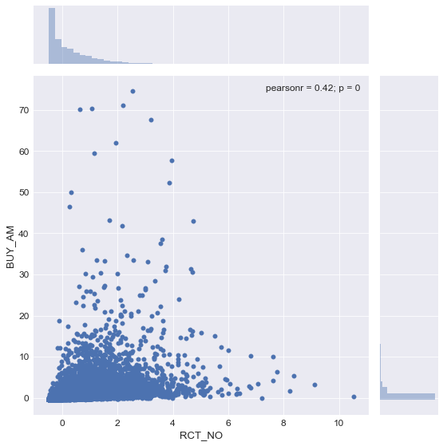
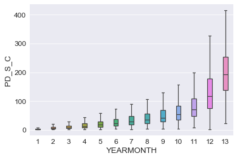
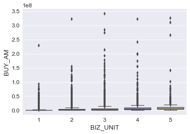
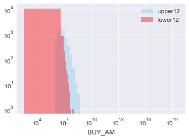
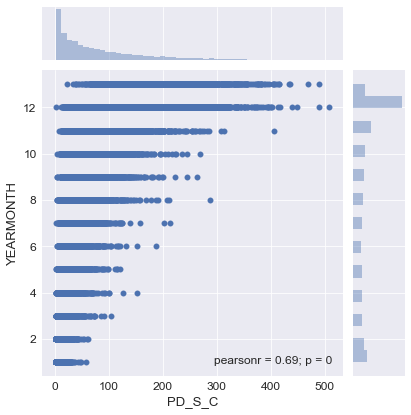

```python
import pandas as pd

import numpy as np

from sklearn.preprocessing import robust_scale, normalize

import matplotlib.pyplot as plt

import seaborn as sns

import pickle as pkl
```

### 수치로 표현할 수 있는 데이터를 중심으로 탐색적 데이터 분석을 실시하였음.

사용자 별로 Feature를 정렬하였으며, 이 때 중심적으로 확인한 Feature는 다음과 같음:

영수증의 개수, 업종의 개수, 소품목의 개수, 소비한 점포의 개수, L-Point를 활용한 달 수, 총 소비 금액


```python
df= pd.read_table('./Pre_processed_data/merged_dataframe_shopping.csv', delimiter= ',', encoding='euc-kr')
```


```python
df.head()
```


<div>
<style scoped>
    .dataframe tbody tr th:only-of-type {
        vertical-align: middle;
    }

    .dataframe tbody tr th {
        vertical-align: top;
    }

    .dataframe thead th {
        text-align: right;
    }
</style>
<table border="1" class="dataframe">
  <thead>
    <tr style="text-align: right;">
      <th></th>
      <th>Unnamed: 0</th>
      <th>ID</th>
      <th>RCT_NO</th>
      <th>BIZ_UNIT</th>
      <th>PD_S_C</th>
      <th>BR_C</th>
      <th>BUY_AM</th>
      <th>BUY_CT</th>
      <th>AGE_PRD</th>
      <th>HOM_PST_NO</th>
      <th>...</th>
      <th>PD_M_NM</th>
      <th>PD_H_NM</th>
      <th>IS_MALE</th>
      <th>IS_FEMALE</th>
      <th>YEAR</th>
      <th>MONTH</th>
      <th>DAY</th>
      <th>HOUR</th>
      <th>PRVIN</th>
      <th>DESTRICT</th>
    </tr>
  </thead>
  <tbody>
    <tr>
      <th>0</th>
      <td>0</td>
      <td>4008</td>
      <td>2108</td>
      <td>A01</td>
      <td>215</td>
      <td>2</td>
      <td>59600</td>
      <td>2</td>
      <td>50</td>
      <td>056</td>
      <td>...</td>
      <td>캐주얼</td>
      <td>여성의류</td>
      <td>0</td>
      <td>1</td>
      <td>2015</td>
      <td>2</td>
      <td>16</td>
      <td>13</td>
      <td>서울특별시</td>
      <td>송파구</td>
    </tr>
    <tr>
      <th>1</th>
      <td>1</td>
      <td>6379</td>
      <td>2109</td>
      <td>A01</td>
      <td>75</td>
      <td>29</td>
      <td>35000</td>
      <td>1</td>
      <td>40</td>
      <td>480</td>
      <td>...</td>
      <td>건강식품</td>
      <td>식품</td>
      <td>1</td>
      <td>0</td>
      <td>2015</td>
      <td>2</td>
      <td>13</td>
      <td>11</td>
      <td>부산광역시</td>
      <td>해운대구</td>
    </tr>
    <tr>
      <th>2</th>
      <td>2</td>
      <td>6379</td>
      <td>2109</td>
      <td>A01</td>
      <td>149</td>
      <td>4</td>
      <td>85000</td>
      <td>1</td>
      <td>40</td>
      <td>480</td>
      <td>...</td>
      <td>화장품</td>
      <td>잡화</td>
      <td>1</td>
      <td>0</td>
      <td>2015</td>
      <td>1</td>
      <td>15</td>
      <td>10</td>
      <td>부산광역시</td>
      <td>해운대구</td>
    </tr>
    <tr>
      <th>3</th>
      <td>3</td>
      <td>8002</td>
      <td>2110</td>
      <td>A01</td>
      <td>138</td>
      <td>10</td>
      <td>25000</td>
      <td>1</td>
      <td>30</td>
      <td>300</td>
      <td>...</td>
      <td>섬유잡화</td>
      <td>잡화</td>
      <td>0</td>
      <td>1</td>
      <td>2015</td>
      <td>12</td>
      <td>20</td>
      <td>10</td>
      <td>세종특별자치시</td>
      <td>NaN</td>
    </tr>
    <tr>
      <th>4</th>
      <td>4</td>
      <td>8002</td>
      <td>2110</td>
      <td>A01</td>
      <td>138</td>
      <td>10</td>
      <td>21000</td>
      <td>1</td>
      <td>30</td>
      <td>300</td>
      <td>...</td>
      <td>섬유잡화</td>
      <td>잡화</td>
      <td>0</td>
      <td>1</td>
      <td>2015</td>
      <td>12</td>
      <td>20</td>
      <td>10</td>
      <td>세종특별자치시</td>
      <td>NaN</td>
    </tr>
  </tbody>
</table>
<p>5 rows × 21 columns</p>
</div>


```python
df.drop('Unnamed: 0', axis= 1, inplace= True)
```


```python
df['YEARMONTH']= 100*df['YEAR']+df['MONTH']
```


```python
df['DAYHOUR']= 100*df['DAY']+ df['HOUR']
```


```python
df.drop(['YEAR', 'MONTH', 'DAY', 'HOUR'], axis= 1, inplace= True)
```


```python
agg_func= {'RCT_NO': lambda x: x.nunique(), 'BIZ_UNIT': lambda x: x.nunique(), 'PD_S_C': lambda x: x.nunique(), 'BR_C': lambda x:x.nunique(), 'YEARMONTH': lambda x: x.nunique(), 'BUY_AM': 'sum'}
```


```python
df_restructured= df.groupby(['ID']).agg(agg_func)
```


```python
df_restructured
```


<div>
<style scoped>
    .dataframe tbody tr th:only-of-type {
        vertical-align: middle;
    }

    .dataframe tbody tr th {
        vertical-align: top;
    }

    .dataframe thead th {
        text-align: right;
    }
</style>
<table border="1" class="dataframe">
  <thead>
    <tr style="text-align: right;">
      <th></th>
      <th>RCT_NO</th>
      <th>BIZ_UNIT</th>
      <th>PD_S_C</th>
      <th>BR_C</th>
      <th>YEARMONTH</th>
      <th>BUY_AM</th>
    </tr>
    <tr>
      <th>ID</th>
      <th></th>
      <th></th>
      <th></th>
      <th></th>
      <th></th>
      <th></th>
    </tr>
  </thead>
  <tbody>
    <tr>
      <th>1</th>
      <td>43</td>
      <td>2</td>
      <td>33</td>
      <td>3</td>
      <td>9</td>
      <td>3695930</td>
    </tr>
    <tr>
      <th>2</th>
      <td>55</td>
      <td>2</td>
      <td>111</td>
      <td>3</td>
      <td>13</td>
      <td>1979142</td>
    </tr>
    <tr>
      <th>3</th>
      <td>32</td>
      <td>3</td>
      <td>61</td>
      <td>7</td>
      <td>10</td>
      <td>2272884</td>
    </tr>
    <tr>
      <th>4</th>
      <td>122</td>
      <td>3</td>
      <td>136</td>
      <td>7</td>
      <td>12</td>
      <td>7970116</td>
    </tr>
    <tr>
      <th>6</th>
      <td>280</td>
      <td>4</td>
      <td>253</td>
      <td>9</td>
      <td>13</td>
      <td>6458914</td>
    </tr>
    <tr>
      <th>7</th>
      <td>50</td>
      <td>2</td>
      <td>28</td>
      <td>3</td>
      <td>11</td>
      <td>2650880</td>
    </tr>
    <tr>
      <th>8</th>
      <td>59</td>
      <td>2</td>
      <td>122</td>
      <td>5</td>
      <td>11</td>
      <td>7635203</td>
    </tr>
    <tr>
      <th>9</th>
      <td>72</td>
      <td>2</td>
      <td>71</td>
      <td>5</td>
      <td>12</td>
      <td>11241966</td>
    </tr>
    <tr>
      <th>10</th>
      <td>11</td>
      <td>1</td>
      <td>8</td>
      <td>1</td>
      <td>6</td>
      <td>351800</td>
    </tr>
    <tr>
      <th>11</th>
      <td>18</td>
      <td>3</td>
      <td>32</td>
      <td>8</td>
      <td>8</td>
      <td>3339228</td>
    </tr>
    <tr>
      <th>13</th>
      <td>8</td>
      <td>1</td>
      <td>6</td>
      <td>1</td>
      <td>4</td>
      <td>502900</td>
    </tr>
    <tr>
      <th>14</th>
      <td>26</td>
      <td>1</td>
      <td>23</td>
      <td>4</td>
      <td>5</td>
      <td>3020410</td>
    </tr>
    <tr>
      <th>15</th>
      <td>54</td>
      <td>3</td>
      <td>43</td>
      <td>4</td>
      <td>11</td>
      <td>5268800</td>
    </tr>
    <tr>
      <th>16</th>
      <td>234</td>
      <td>3</td>
      <td>262</td>
      <td>4</td>
      <td>13</td>
      <td>26818574</td>
    </tr>
    <tr>
      <th>17</th>
      <td>51</td>
      <td>3</td>
      <td>48</td>
      <td>7</td>
      <td>12</td>
      <td>2546768</td>
    </tr>
    <tr>
      <th>18</th>
      <td>77</td>
      <td>3</td>
      <td>100</td>
      <td>7</td>
      <td>12</td>
      <td>2576903</td>
    </tr>
    <tr>
      <th>19</th>
      <td>14</td>
      <td>4</td>
      <td>15</td>
      <td>7</td>
      <td>7</td>
      <td>1467900</td>
    </tr>
    <tr>
      <th>20</th>
      <td>114</td>
      <td>4</td>
      <td>103</td>
      <td>10</td>
      <td>12</td>
      <td>1455785</td>
    </tr>
    <tr>
      <th>21</th>
      <td>164</td>
      <td>3</td>
      <td>161</td>
      <td>5</td>
      <td>13</td>
      <td>4924329</td>
    </tr>
    <tr>
      <th>22</th>
      <td>195</td>
      <td>3</td>
      <td>128</td>
      <td>7</td>
      <td>11</td>
      <td>7434376</td>
    </tr>
    <tr>
      <th>23</th>
      <td>5</td>
      <td>1</td>
      <td>4</td>
      <td>2</td>
      <td>3</td>
      <td>61500</td>
    </tr>
    <tr>
      <th>24</th>
      <td>24</td>
      <td>2</td>
      <td>46</td>
      <td>3</td>
      <td>8</td>
      <td>7946686</td>
    </tr>
    <tr>
      <th>25</th>
      <td>10</td>
      <td>1</td>
      <td>7</td>
      <td>1</td>
      <td>3</td>
      <td>724300</td>
    </tr>
    <tr>
      <th>26</th>
      <td>54</td>
      <td>2</td>
      <td>42</td>
      <td>4</td>
      <td>11</td>
      <td>1545640</td>
    </tr>
    <tr>
      <th>27</th>
      <td>62</td>
      <td>2</td>
      <td>30</td>
      <td>6</td>
      <td>12</td>
      <td>2187410</td>
    </tr>
    <tr>
      <th>28</th>
      <td>29</td>
      <td>3</td>
      <td>40</td>
      <td>8</td>
      <td>11</td>
      <td>921276</td>
    </tr>
    <tr>
      <th>29</th>
      <td>79</td>
      <td>2</td>
      <td>159</td>
      <td>5</td>
      <td>12</td>
      <td>3756730</td>
    </tr>
    <tr>
      <th>30</th>
      <td>124</td>
      <td>3</td>
      <td>113</td>
      <td>6</td>
      <td>12</td>
      <td>2505140</td>
    </tr>
    <tr>
      <th>31</th>
      <td>19</td>
      <td>2</td>
      <td>14</td>
      <td>3</td>
      <td>10</td>
      <td>710900</td>
    </tr>
    <tr>
      <th>32</th>
      <td>5</td>
      <td>1</td>
      <td>5</td>
      <td>2</td>
      <td>4</td>
      <td>404800</td>
    </tr>
    <tr>
      <th>...</th>
      <td>...</td>
      <td>...</td>
      <td>...</td>
      <td>...</td>
      <td>...</td>
      <td>...</td>
    </tr>
    <tr>
      <th>19957</th>
      <td>1</td>
      <td>1</td>
      <td>6</td>
      <td>1</td>
      <td>1</td>
      <td>34900</td>
    </tr>
    <tr>
      <th>19959</th>
      <td>1</td>
      <td>1</td>
      <td>25</td>
      <td>1</td>
      <td>1</td>
      <td>86528</td>
    </tr>
    <tr>
      <th>19961</th>
      <td>6</td>
      <td>3</td>
      <td>15</td>
      <td>3</td>
      <td>2</td>
      <td>255570</td>
    </tr>
    <tr>
      <th>19962</th>
      <td>17</td>
      <td>2</td>
      <td>56</td>
      <td>3</td>
      <td>3</td>
      <td>1799744</td>
    </tr>
    <tr>
      <th>19963</th>
      <td>1</td>
      <td>1</td>
      <td>1</td>
      <td>1</td>
      <td>1</td>
      <td>6500</td>
    </tr>
    <tr>
      <th>19964</th>
      <td>3</td>
      <td>2</td>
      <td>37</td>
      <td>2</td>
      <td>2</td>
      <td>218730</td>
    </tr>
    <tr>
      <th>19965</th>
      <td>1</td>
      <td>1</td>
      <td>11</td>
      <td>1</td>
      <td>1</td>
      <td>226420</td>
    </tr>
    <tr>
      <th>19966</th>
      <td>1</td>
      <td>1</td>
      <td>4</td>
      <td>1</td>
      <td>1</td>
      <td>23860</td>
    </tr>
    <tr>
      <th>19968</th>
      <td>13</td>
      <td>1</td>
      <td>21</td>
      <td>1</td>
      <td>3</td>
      <td>220347</td>
    </tr>
    <tr>
      <th>19970</th>
      <td>3</td>
      <td>1</td>
      <td>10</td>
      <td>1</td>
      <td>1</td>
      <td>968200</td>
    </tr>
    <tr>
      <th>19973</th>
      <td>3</td>
      <td>1</td>
      <td>3</td>
      <td>1</td>
      <td>2</td>
      <td>362200</td>
    </tr>
    <tr>
      <th>19974</th>
      <td>6</td>
      <td>2</td>
      <td>40</td>
      <td>4</td>
      <td>3</td>
      <td>449266</td>
    </tr>
    <tr>
      <th>19975</th>
      <td>3</td>
      <td>1</td>
      <td>1</td>
      <td>1</td>
      <td>1</td>
      <td>898000</td>
    </tr>
    <tr>
      <th>19978</th>
      <td>2</td>
      <td>2</td>
      <td>6</td>
      <td>2</td>
      <td>2</td>
      <td>604400</td>
    </tr>
    <tr>
      <th>19979</th>
      <td>3</td>
      <td>1</td>
      <td>3</td>
      <td>1</td>
      <td>1</td>
      <td>147800</td>
    </tr>
    <tr>
      <th>19981</th>
      <td>8</td>
      <td>2</td>
      <td>6</td>
      <td>2</td>
      <td>2</td>
      <td>246680</td>
    </tr>
    <tr>
      <th>19982</th>
      <td>1</td>
      <td>1</td>
      <td>1</td>
      <td>1</td>
      <td>1</td>
      <td>45000</td>
    </tr>
    <tr>
      <th>19983</th>
      <td>1</td>
      <td>1</td>
      <td>2</td>
      <td>1</td>
      <td>1</td>
      <td>4930</td>
    </tr>
    <tr>
      <th>19984</th>
      <td>1</td>
      <td>1</td>
      <td>1</td>
      <td>1</td>
      <td>1</td>
      <td>10000</td>
    </tr>
    <tr>
      <th>19985</th>
      <td>4</td>
      <td>1</td>
      <td>11</td>
      <td>1</td>
      <td>1</td>
      <td>91620</td>
    </tr>
    <tr>
      <th>19987</th>
      <td>2</td>
      <td>2</td>
      <td>4</td>
      <td>2</td>
      <td>1</td>
      <td>20510</td>
    </tr>
    <tr>
      <th>19988</th>
      <td>1</td>
      <td>1</td>
      <td>2</td>
      <td>1</td>
      <td>1</td>
      <td>34800</td>
    </tr>
    <tr>
      <th>19989</th>
      <td>1</td>
      <td>1</td>
      <td>1</td>
      <td>1</td>
      <td>1</td>
      <td>2590</td>
    </tr>
    <tr>
      <th>19992</th>
      <td>2</td>
      <td>2</td>
      <td>2</td>
      <td>2</td>
      <td>1</td>
      <td>24000</td>
    </tr>
    <tr>
      <th>19995</th>
      <td>1</td>
      <td>1</td>
      <td>1</td>
      <td>1</td>
      <td>1</td>
      <td>79800</td>
    </tr>
    <tr>
      <th>19996</th>
      <td>1</td>
      <td>1</td>
      <td>25</td>
      <td>1</td>
      <td>1</td>
      <td>272500</td>
    </tr>
    <tr>
      <th>19997</th>
      <td>2</td>
      <td>1</td>
      <td>16</td>
      <td>1</td>
      <td>1</td>
      <td>136368</td>
    </tr>
    <tr>
      <th>19998</th>
      <td>2</td>
      <td>1</td>
      <td>7</td>
      <td>1</td>
      <td>1</td>
      <td>143700</td>
    </tr>
    <tr>
      <th>19999</th>
      <td>1</td>
      <td>1</td>
      <td>1</td>
      <td>1</td>
      <td>1</td>
      <td>179000</td>
    </tr>
    <tr>
      <th>20000</th>
      <td>1</td>
      <td>1</td>
      <td>1</td>
      <td>1</td>
      <td>1</td>
      <td>69000</td>
    </tr>
  </tbody>
</table>
<p>18550 rows × 6 columns</p>
</div>


### 소비액을 기준으로 사용자를 정렬하였음.

이 때 상위 소비자는 150개 전후의 품목을 소비하면서 L-Point를 활용하고 있었음. 또한 대부분이 11~13개월 동안 L-Point를 사용한 사용자였으며, 업종이나 점포 역시 다양하게 활용하는 것으로 나타났음.


```python
df_restructured.sort_values(by= ['BUY_AM'], ascending= False)
```


<div>
<style scoped>
    .dataframe tbody tr th:only-of-type {
        vertical-align: middle;
    }

    .dataframe tbody tr th {
        vertical-align: top;
    }

    .dataframe thead th {
        text-align: right;
    }
</style>
<table border="1" class="dataframe">
  <thead>
    <tr style="text-align: right;">
      <th></th>
      <th>RCT_NO</th>
      <th>BIZ_UNIT</th>
      <th>PD_S_C</th>
      <th>BR_C</th>
      <th>YEARMONTH</th>
      <th>BUY_AM</th>
    </tr>
    <tr>
      <th>ID</th>
      <th></th>
      <th></th>
      <th></th>
      <th></th>
      <th></th>
      <th></th>
    </tr>
  </thead>
  <tbody>
    <tr>
      <th>13087</th>
      <td>175</td>
      <td>3</td>
      <td>145</td>
      <td>25</td>
      <td>12</td>
      <td>1223499836</td>
    </tr>
    <tr>
      <th>7278</th>
      <td>215</td>
      <td>3</td>
      <td>102</td>
      <td>7</td>
      <td>12</td>
      <td>342051200</td>
    </tr>
    <tr>
      <th>12557</th>
      <td>190</td>
      <td>5</td>
      <td>184</td>
      <td>31</td>
      <td>12</td>
      <td>326478568</td>
    </tr>
    <tr>
      <th>2807</th>
      <td>110</td>
      <td>4</td>
      <td>146</td>
      <td>17</td>
      <td>12</td>
      <td>323160907</td>
    </tr>
    <tr>
      <th>2863</th>
      <td>80</td>
      <td>2</td>
      <td>88</td>
      <td>8</td>
      <td>12</td>
      <td>322098622</td>
    </tr>
    <tr>
      <th>9038</th>
      <td>262</td>
      <td>5</td>
      <td>200</td>
      <td>12</td>
      <td>12</td>
      <td>310334084</td>
    </tr>
    <tr>
      <th>6663</th>
      <td>173</td>
      <td>3</td>
      <td>67</td>
      <td>10</td>
      <td>12</td>
      <td>284605677</td>
    </tr>
    <tr>
      <th>2363</th>
      <td>116</td>
      <td>3</td>
      <td>151</td>
      <td>8</td>
      <td>12</td>
      <td>273316980</td>
    </tr>
    <tr>
      <th>3020</th>
      <td>315</td>
      <td>5</td>
      <td>250</td>
      <td>19</td>
      <td>12</td>
      <td>265696983</td>
    </tr>
    <tr>
      <th>7039</th>
      <td>310</td>
      <td>4</td>
      <td>157</td>
      <td>25</td>
      <td>13</td>
      <td>240652200</td>
    </tr>
    <tr>
      <th>11447</th>
      <td>57</td>
      <td>1</td>
      <td>38</td>
      <td>2</td>
      <td>10</td>
      <td>229759930</td>
    </tr>
    <tr>
      <th>1584</th>
      <td>54</td>
      <td>3</td>
      <td>111</td>
      <td>5</td>
      <td>12</td>
      <td>214148828</td>
    </tr>
    <tr>
      <th>7664</th>
      <td>156</td>
      <td>4</td>
      <td>166</td>
      <td>17</td>
      <td>12</td>
      <td>198814920</td>
    </tr>
    <tr>
      <th>15554</th>
      <td>371</td>
      <td>4</td>
      <td>277</td>
      <td>13</td>
      <td>13</td>
      <td>197909636</td>
    </tr>
    <tr>
      <th>1609</th>
      <td>189</td>
      <td>3</td>
      <td>155</td>
      <td>9</td>
      <td>12</td>
      <td>192735064</td>
    </tr>
    <tr>
      <th>1391</th>
      <td>291</td>
      <td>3</td>
      <td>178</td>
      <td>10</td>
      <td>12</td>
      <td>177621610</td>
    </tr>
    <tr>
      <th>2251</th>
      <td>286</td>
      <td>4</td>
      <td>282</td>
      <td>14</td>
      <td>12</td>
      <td>173482495</td>
    </tr>
    <tr>
      <th>6123</th>
      <td>87</td>
      <td>3</td>
      <td>129</td>
      <td>19</td>
      <td>11</td>
      <td>165821250</td>
    </tr>
    <tr>
      <th>3156</th>
      <td>201</td>
      <td>3</td>
      <td>216</td>
      <td>6</td>
      <td>12</td>
      <td>159949856</td>
    </tr>
    <tr>
      <th>7075</th>
      <td>122</td>
      <td>4</td>
      <td>137</td>
      <td>8</td>
      <td>12</td>
      <td>154620614</td>
    </tr>
    <tr>
      <th>1487</th>
      <td>217</td>
      <td>2</td>
      <td>178</td>
      <td>8</td>
      <td>12</td>
      <td>154329510</td>
    </tr>
    <tr>
      <th>12145</th>
      <td>144</td>
      <td>4</td>
      <td>133</td>
      <td>26</td>
      <td>13</td>
      <td>153901922</td>
    </tr>
    <tr>
      <th>7089</th>
      <td>254</td>
      <td>3</td>
      <td>416</td>
      <td>59</td>
      <td>12</td>
      <td>152732118</td>
    </tr>
    <tr>
      <th>1809</th>
      <td>302</td>
      <td>2</td>
      <td>115</td>
      <td>3</td>
      <td>12</td>
      <td>147256760</td>
    </tr>
    <tr>
      <th>611</th>
      <td>365</td>
      <td>3</td>
      <td>227</td>
      <td>11</td>
      <td>12</td>
      <td>144966516</td>
    </tr>
    <tr>
      <th>19434</th>
      <td>300</td>
      <td>3</td>
      <td>199</td>
      <td>16</td>
      <td>12</td>
      <td>143056560</td>
    </tr>
    <tr>
      <th>6612</th>
      <td>369</td>
      <td>5</td>
      <td>356</td>
      <td>19</td>
      <td>12</td>
      <td>141512505</td>
    </tr>
    <tr>
      <th>3015</th>
      <td>134</td>
      <td>2</td>
      <td>23</td>
      <td>4</td>
      <td>11</td>
      <td>140250356</td>
    </tr>
    <tr>
      <th>1645</th>
      <td>95</td>
      <td>2</td>
      <td>73</td>
      <td>6</td>
      <td>12</td>
      <td>139849900</td>
    </tr>
    <tr>
      <th>11441</th>
      <td>176</td>
      <td>2</td>
      <td>108</td>
      <td>4</td>
      <td>12</td>
      <td>139324719</td>
    </tr>
    <tr>
      <th>...</th>
      <td>...</td>
      <td>...</td>
      <td>...</td>
      <td>...</td>
      <td>...</td>
      <td>...</td>
    </tr>
    <tr>
      <th>1562</th>
      <td>1</td>
      <td>1</td>
      <td>1</td>
      <td>1</td>
      <td>1</td>
      <td>2600</td>
    </tr>
    <tr>
      <th>18181</th>
      <td>1</td>
      <td>1</td>
      <td>1</td>
      <td>1</td>
      <td>1</td>
      <td>2600</td>
    </tr>
    <tr>
      <th>19989</th>
      <td>1</td>
      <td>1</td>
      <td>1</td>
      <td>1</td>
      <td>1</td>
      <td>2590</td>
    </tr>
    <tr>
      <th>12510</th>
      <td>1</td>
      <td>1</td>
      <td>1</td>
      <td>1</td>
      <td>1</td>
      <td>2500</td>
    </tr>
    <tr>
      <th>16444</th>
      <td>1</td>
      <td>1</td>
      <td>2</td>
      <td>1</td>
      <td>1</td>
      <td>2500</td>
    </tr>
    <tr>
      <th>16834</th>
      <td>2</td>
      <td>1</td>
      <td>2</td>
      <td>2</td>
      <td>2</td>
      <td>2400</td>
    </tr>
    <tr>
      <th>10089</th>
      <td>1</td>
      <td>1</td>
      <td>1</td>
      <td>1</td>
      <td>1</td>
      <td>2400</td>
    </tr>
    <tr>
      <th>12431</th>
      <td>1</td>
      <td>1</td>
      <td>3</td>
      <td>1</td>
      <td>1</td>
      <td>2350</td>
    </tr>
    <tr>
      <th>4715</th>
      <td>1</td>
      <td>1</td>
      <td>1</td>
      <td>1</td>
      <td>1</td>
      <td>2350</td>
    </tr>
    <tr>
      <th>19819</th>
      <td>1</td>
      <td>1</td>
      <td>2</td>
      <td>1</td>
      <td>1</td>
      <td>2300</td>
    </tr>
    <tr>
      <th>17414</th>
      <td>1</td>
      <td>1</td>
      <td>2</td>
      <td>1</td>
      <td>1</td>
      <td>2200</td>
    </tr>
    <tr>
      <th>19897</th>
      <td>1</td>
      <td>1</td>
      <td>1</td>
      <td>1</td>
      <td>1</td>
      <td>2000</td>
    </tr>
    <tr>
      <th>10538</th>
      <td>1</td>
      <td>1</td>
      <td>2</td>
      <td>1</td>
      <td>1</td>
      <td>2000</td>
    </tr>
    <tr>
      <th>16957</th>
      <td>1</td>
      <td>1</td>
      <td>1</td>
      <td>1</td>
      <td>1</td>
      <td>2000</td>
    </tr>
    <tr>
      <th>9042</th>
      <td>1</td>
      <td>1</td>
      <td>1</td>
      <td>1</td>
      <td>1</td>
      <td>2000</td>
    </tr>
    <tr>
      <th>16611</th>
      <td>1</td>
      <td>1</td>
      <td>1</td>
      <td>1</td>
      <td>1</td>
      <td>1980</td>
    </tr>
    <tr>
      <th>17957</th>
      <td>1</td>
      <td>1</td>
      <td>1</td>
      <td>1</td>
      <td>1</td>
      <td>1950</td>
    </tr>
    <tr>
      <th>19428</th>
      <td>1</td>
      <td>1</td>
      <td>2</td>
      <td>1</td>
      <td>1</td>
      <td>1800</td>
    </tr>
    <tr>
      <th>9900</th>
      <td>1</td>
      <td>1</td>
      <td>1</td>
      <td>1</td>
      <td>1</td>
      <td>1800</td>
    </tr>
    <tr>
      <th>13374</th>
      <td>1</td>
      <td>1</td>
      <td>2</td>
      <td>1</td>
      <td>1</td>
      <td>1700</td>
    </tr>
    <tr>
      <th>19287</th>
      <td>1</td>
      <td>1</td>
      <td>1</td>
      <td>1</td>
      <td>1</td>
      <td>1700</td>
    </tr>
    <tr>
      <th>19175</th>
      <td>1</td>
      <td>1</td>
      <td>1</td>
      <td>1</td>
      <td>1</td>
      <td>1700</td>
    </tr>
    <tr>
      <th>12828</th>
      <td>1</td>
      <td>1</td>
      <td>1</td>
      <td>1</td>
      <td>1</td>
      <td>1600</td>
    </tr>
    <tr>
      <th>3649</th>
      <td>1</td>
      <td>1</td>
      <td>1</td>
      <td>1</td>
      <td>1</td>
      <td>1500</td>
    </tr>
    <tr>
      <th>19835</th>
      <td>1</td>
      <td>1</td>
      <td>1</td>
      <td>1</td>
      <td>1</td>
      <td>1500</td>
    </tr>
    <tr>
      <th>15250</th>
      <td>1</td>
      <td>1</td>
      <td>1</td>
      <td>1</td>
      <td>1</td>
      <td>1300</td>
    </tr>
    <tr>
      <th>19349</th>
      <td>1</td>
      <td>1</td>
      <td>1</td>
      <td>1</td>
      <td>1</td>
      <td>1000</td>
    </tr>
    <tr>
      <th>18651</th>
      <td>1</td>
      <td>1</td>
      <td>1</td>
      <td>1</td>
      <td>1</td>
      <td>950</td>
    </tr>
    <tr>
      <th>19183</th>
      <td>1</td>
      <td>1</td>
      <td>1</td>
      <td>1</td>
      <td>1</td>
      <td>850</td>
    </tr>
    <tr>
      <th>2471</th>
      <td>1</td>
      <td>1</td>
      <td>1</td>
      <td>1</td>
      <td>1</td>
      <td>400</td>
    </tr>
  </tbody>
</table>
<p>18550 rows × 6 columns</p>
</div>


```python
df_restructured.drop(13087, axis= 0, inplace= True)

# 너무 사용액이 큰 이상점 13087 사용자를 삭제하였음.
```

### 영수증의 개수를 기준으로 사용자를 정렬하였음.

이 때 상위 소비자는 400~1200여 번 소비하면서 150~500여 종류의 품목을 소비하는 것으로 나타났음. L-Point를 사용한 달 수도 일반적으로 12개월 이상으로 나타났지만, 소비액은 일반적으로 5천만 원 이하로 나타나 소비액 기준 상위 소비자와 다를 것으로 예상됨.


```python
df_restructured.sort_values(by= ['RCT_NO'], ascending= False)
```


<div>
<style scoped>
    .dataframe tbody tr th:only-of-type {
        vertical-align: middle;
    }

    .dataframe tbody tr th {
        vertical-align: top;
    }

    .dataframe thead th {
        text-align: right;
    }
</style>
<table border="1" class="dataframe">
  <thead>
    <tr style="text-align: right;">
      <th></th>
      <th>RCT_NO</th>
      <th>BIZ_UNIT</th>
      <th>PD_S_C</th>
      <th>BR_C</th>
      <th>YEARMONTH</th>
      <th>BUY_AM</th>
    </tr>
    <tr>
      <th>ID</th>
      <th></th>
      <th></th>
      <th></th>
      <th></th>
      <th></th>
      <th></th>
    </tr>
  </thead>
  <tbody>
    <tr>
      <th>16742</th>
      <td>1192</td>
      <td>1</td>
      <td>260</td>
      <td>1</td>
      <td>12</td>
      <td>13092690</td>
    </tr>
    <tr>
      <th>12178</th>
      <td>919</td>
      <td>4</td>
      <td>401</td>
      <td>7</td>
      <td>12</td>
      <td>23057858</td>
    </tr>
    <tr>
      <th>4500</th>
      <td>782</td>
      <td>3</td>
      <td>203</td>
      <td>4</td>
      <td>12</td>
      <td>3618460</td>
    </tr>
    <tr>
      <th>5264</th>
      <td>682</td>
      <td>4</td>
      <td>436</td>
      <td>18</td>
      <td>13</td>
      <td>16251166</td>
    </tr>
    <tr>
      <th>327</th>
      <td>629</td>
      <td>3</td>
      <td>334</td>
      <td>7</td>
      <td>13</td>
      <td>26657802</td>
    </tr>
    <tr>
      <th>1951</th>
      <td>619</td>
      <td>4</td>
      <td>277</td>
      <td>16</td>
      <td>13</td>
      <td>9370727</td>
    </tr>
    <tr>
      <th>1715</th>
      <td>587</td>
      <td>4</td>
      <td>446</td>
      <td>14</td>
      <td>13</td>
      <td>31154736</td>
    </tr>
    <tr>
      <th>4505</th>
      <td>576</td>
      <td>4</td>
      <td>512</td>
      <td>25</td>
      <td>12</td>
      <td>47692563</td>
    </tr>
    <tr>
      <th>9677</th>
      <td>576</td>
      <td>4</td>
      <td>600</td>
      <td>7</td>
      <td>13</td>
      <td>21005422</td>
    </tr>
    <tr>
      <th>15260</th>
      <td>548</td>
      <td>1</td>
      <td>132</td>
      <td>1</td>
      <td>9</td>
      <td>1362100</td>
    </tr>
    <tr>
      <th>5516</th>
      <td>537</td>
      <td>4</td>
      <td>305</td>
      <td>18</td>
      <td>12</td>
      <td>17760546</td>
    </tr>
    <tr>
      <th>4209</th>
      <td>519</td>
      <td>3</td>
      <td>274</td>
      <td>6</td>
      <td>12</td>
      <td>13280614</td>
    </tr>
    <tr>
      <th>1748</th>
      <td>518</td>
      <td>5</td>
      <td>409</td>
      <td>12</td>
      <td>13</td>
      <td>48602910</td>
    </tr>
    <tr>
      <th>9202</th>
      <td>514</td>
      <td>3</td>
      <td>226</td>
      <td>5</td>
      <td>12</td>
      <td>14556382</td>
    </tr>
    <tr>
      <th>8929</th>
      <td>489</td>
      <td>4</td>
      <td>248</td>
      <td>13</td>
      <td>12</td>
      <td>7303757</td>
    </tr>
    <tr>
      <th>11516</th>
      <td>484</td>
      <td>5</td>
      <td>408</td>
      <td>51</td>
      <td>13</td>
      <td>12440938</td>
    </tr>
    <tr>
      <th>15609</th>
      <td>484</td>
      <td>3</td>
      <td>272</td>
      <td>5</td>
      <td>13</td>
      <td>6783713</td>
    </tr>
    <tr>
      <th>16878</th>
      <td>482</td>
      <td>1</td>
      <td>244</td>
      <td>2</td>
      <td>12</td>
      <td>6276953</td>
    </tr>
    <tr>
      <th>865</th>
      <td>465</td>
      <td>3</td>
      <td>350</td>
      <td>9</td>
      <td>13</td>
      <td>17386602</td>
    </tr>
    <tr>
      <th>756</th>
      <td>462</td>
      <td>5</td>
      <td>296</td>
      <td>9</td>
      <td>12</td>
      <td>54459349</td>
    </tr>
    <tr>
      <th>3488</th>
      <td>462</td>
      <td>4</td>
      <td>327</td>
      <td>15</td>
      <td>13</td>
      <td>6683598</td>
    </tr>
    <tr>
      <th>945</th>
      <td>458</td>
      <td>3</td>
      <td>242</td>
      <td>7</td>
      <td>12</td>
      <td>21644255</td>
    </tr>
    <tr>
      <th>9874</th>
      <td>452</td>
      <td>2</td>
      <td>344</td>
      <td>8</td>
      <td>13</td>
      <td>22789541</td>
    </tr>
    <tr>
      <th>8942</th>
      <td>445</td>
      <td>4</td>
      <td>342</td>
      <td>16</td>
      <td>13</td>
      <td>5165311</td>
    </tr>
    <tr>
      <th>178</th>
      <td>443</td>
      <td>3</td>
      <td>288</td>
      <td>6</td>
      <td>13</td>
      <td>58203861</td>
    </tr>
    <tr>
      <th>5475</th>
      <td>442</td>
      <td>3</td>
      <td>416</td>
      <td>12</td>
      <td>13</td>
      <td>11226007</td>
    </tr>
    <tr>
      <th>2948</th>
      <td>439</td>
      <td>3</td>
      <td>292</td>
      <td>12</td>
      <td>13</td>
      <td>37382307</td>
    </tr>
    <tr>
      <th>7527</th>
      <td>435</td>
      <td>4</td>
      <td>333</td>
      <td>21</td>
      <td>12</td>
      <td>8336079</td>
    </tr>
    <tr>
      <th>2514</th>
      <td>427</td>
      <td>3</td>
      <td>282</td>
      <td>5</td>
      <td>13</td>
      <td>70571367</td>
    </tr>
    <tr>
      <th>15943</th>
      <td>415</td>
      <td>2</td>
      <td>247</td>
      <td>2</td>
      <td>12</td>
      <td>3781653</td>
    </tr>
    <tr>
      <th>...</th>
      <td>...</td>
      <td>...</td>
      <td>...</td>
      <td>...</td>
      <td>...</td>
      <td>...</td>
    </tr>
    <tr>
      <th>17668</th>
      <td>1</td>
      <td>1</td>
      <td>2</td>
      <td>1</td>
      <td>1</td>
      <td>54000</td>
    </tr>
    <tr>
      <th>11952</th>
      <td>1</td>
      <td>1</td>
      <td>1</td>
      <td>1</td>
      <td>1</td>
      <td>316400</td>
    </tr>
    <tr>
      <th>11959</th>
      <td>1</td>
      <td>1</td>
      <td>3</td>
      <td>1</td>
      <td>1</td>
      <td>22370</td>
    </tr>
    <tr>
      <th>17658</th>
      <td>1</td>
      <td>1</td>
      <td>1</td>
      <td>1</td>
      <td>1</td>
      <td>119000</td>
    </tr>
    <tr>
      <th>1121</th>
      <td>1</td>
      <td>1</td>
      <td>1</td>
      <td>1</td>
      <td>1</td>
      <td>36000</td>
    </tr>
    <tr>
      <th>17654</th>
      <td>1</td>
      <td>1</td>
      <td>1</td>
      <td>1</td>
      <td>1</td>
      <td>16900</td>
    </tr>
    <tr>
      <th>11843</th>
      <td>1</td>
      <td>1</td>
      <td>6</td>
      <td>1</td>
      <td>1</td>
      <td>32060</td>
    </tr>
    <tr>
      <th>17772</th>
      <td>1</td>
      <td>1</td>
      <td>1</td>
      <td>1</td>
      <td>1</td>
      <td>105600</td>
    </tr>
    <tr>
      <th>17789</th>
      <td>1</td>
      <td>1</td>
      <td>1</td>
      <td>1</td>
      <td>1</td>
      <td>6000</td>
    </tr>
    <tr>
      <th>1026</th>
      <td>1</td>
      <td>1</td>
      <td>8</td>
      <td>1</td>
      <td>1</td>
      <td>67600</td>
    </tr>
    <tr>
      <th>17905</th>
      <td>1</td>
      <td>1</td>
      <td>1</td>
      <td>1</td>
      <td>1</td>
      <td>170000</td>
    </tr>
    <tr>
      <th>5745</th>
      <td>1</td>
      <td>1</td>
      <td>3</td>
      <td>1</td>
      <td>1</td>
      <td>26150</td>
    </tr>
    <tr>
      <th>17895</th>
      <td>1</td>
      <td>1</td>
      <td>1</td>
      <td>1</td>
      <td>1</td>
      <td>13000</td>
    </tr>
    <tr>
      <th>5734</th>
      <td>1</td>
      <td>1</td>
      <td>4</td>
      <td>1</td>
      <td>1</td>
      <td>25240</td>
    </tr>
    <tr>
      <th>17885</th>
      <td>1</td>
      <td>1</td>
      <td>3</td>
      <td>1</td>
      <td>1</td>
      <td>16600</td>
    </tr>
    <tr>
      <th>17873</th>
      <td>1</td>
      <td>1</td>
      <td>1</td>
      <td>1</td>
      <td>1</td>
      <td>19000</td>
    </tr>
    <tr>
      <th>5724</th>
      <td>1</td>
      <td>1</td>
      <td>1</td>
      <td>1</td>
      <td>1</td>
      <td>5600</td>
    </tr>
    <tr>
      <th>17866</th>
      <td>1</td>
      <td>1</td>
      <td>3</td>
      <td>1</td>
      <td>1</td>
      <td>5050</td>
    </tr>
    <tr>
      <th>11699</th>
      <td>1</td>
      <td>1</td>
      <td>3</td>
      <td>1</td>
      <td>1</td>
      <td>17500</td>
    </tr>
    <tr>
      <th>17862</th>
      <td>1</td>
      <td>1</td>
      <td>3</td>
      <td>1</td>
      <td>1</td>
      <td>22040</td>
    </tr>
    <tr>
      <th>17846</th>
      <td>1</td>
      <td>1</td>
      <td>1</td>
      <td>1</td>
      <td>1</td>
      <td>55000</td>
    </tr>
    <tr>
      <th>11713</th>
      <td>1</td>
      <td>1</td>
      <td>1</td>
      <td>1</td>
      <td>1</td>
      <td>140000</td>
    </tr>
    <tr>
      <th>17839</th>
      <td>1</td>
      <td>1</td>
      <td>7</td>
      <td>1</td>
      <td>1</td>
      <td>89062</td>
    </tr>
    <tr>
      <th>5693</th>
      <td>1</td>
      <td>1</td>
      <td>5</td>
      <td>1</td>
      <td>1</td>
      <td>82220</td>
    </tr>
    <tr>
      <th>11742</th>
      <td>1</td>
      <td>1</td>
      <td>2</td>
      <td>1</td>
      <td>1</td>
      <td>16350</td>
    </tr>
    <tr>
      <th>17823</th>
      <td>1</td>
      <td>1</td>
      <td>1</td>
      <td>1</td>
      <td>1</td>
      <td>12000</td>
    </tr>
    <tr>
      <th>11764</th>
      <td>1</td>
      <td>1</td>
      <td>1</td>
      <td>1</td>
      <td>1</td>
      <td>210000</td>
    </tr>
    <tr>
      <th>17812</th>
      <td>1</td>
      <td>1</td>
      <td>1</td>
      <td>1</td>
      <td>1</td>
      <td>12000</td>
    </tr>
    <tr>
      <th>11766</th>
      <td>1</td>
      <td>1</td>
      <td>1</td>
      <td>1</td>
      <td>1</td>
      <td>159000</td>
    </tr>
    <tr>
      <th>20000</th>
      <td>1</td>
      <td>1</td>
      <td>1</td>
      <td>1</td>
      <td>1</td>
      <td>69000</td>
    </tr>
  </tbody>
</table>
<p>18549 rows × 6 columns</p>
</div>


```python
df_restructured.drop([16742, 12178], axis= 0, inplace= True)

# 너무 영수증의 개수가 큰 이상점 16742, 12178 사용자를 삭제하였음.
```


```python
sns.set()
```


```python
sns.set_context("paper", font_scale= 1.5, rc={"lines.linewidth": 1.2, })
```


```python
x = np.linspace(0, 14, 100)
for i in range(1, 7):
    plt.plot(x, np.sin(x + i * .5) * (7 - i))
plt.show()
```


```python
df_toplt= pd.DataFrame(robust_scale(df_restructured[['RCT_NO', 'PD_S_C', 'BR_C', 'BUY_AM']]), columns= ['RCT_NO', 'PD_S_C', 'BR_C', 'BUY_AM'])
```


```python
logmin, logmax= np.log(df_restructured['BUY_AM'].min()), np.log(df_restructured['BUY_AM'].max())
```


```python
newbins= np.logspace(logmin, logmax, 50)
```

### 영수증의 개수를 중심으로 시각화를 진행하였음.

이 때 다른 Feature에 비해 Scale이 매우 큰 소비액의 경우만 Scaling을 실시하였으며, Feature의 종류에 따라 다른 그래프를 활용하였음.


```python
grp= sns.distplot(df_restructured['RCT_NO'], bins= 50, kde= False)
```


```python
plt.show()
```


```python
grp= sns.boxplot(x= 'BIZ_UNIT', y= 'RCT_NO', data= df_restructured)
```


```python
plt.show()
```


```python
grp= sns.boxplot(x= 'BIZ_UNIT', y= 'RCT_NO', data= df_restructured, showfliers= False)
```


```python
plt.show()
```


```python
grp= sns.jointplot(df_toplt['RCT_NO'], df_toplt['PD_S_C'], size= 8)
```


```python
plt.show()
```


```python
grp= sns.jointplot(df_restructured['RCT_NO'], df_restructured['BR_C'], size= 8)
```


```python
plt.show()
```


```python
grp= sns.boxplot(x= 'YEARMONTH', y= 'RCT_NO', data= df_restructured, width= 0.3)
```


```python
plt.show()
```


```python
grp= sns.boxplot(x= 'YEARMONTH', y= 'RCT_NO', data= df_restructured, showfliers= False, width= 0.3)
```


```python
plt.show()
```


```python
grp= sns.jointplot(df_toplt['RCT_NO'], df_toplt['BUY_AM'], size= 8)
```


```python
plt.show()
```





### 소품목 종류의 개수를 중심으로 시각화를 진행하였음.


```python
grp= sns.distplot(df_restructured['PD_S_C'], bins= 50, kde= False)
```


```python
plt.show()
```


```python
grp= sns.boxplot(x= 'BIZ_UNIT', y= 'PD_S_C', data= df_restructured)
```


```python
plt.show()
```


```python
grp= sns.boxplot(x= 'BIZ_UNIT', y= 'PD_S_C', data= df_restructured, showfliers= False)
```


```python
plt.show()
```


```python
grp= sns.jointplot(df_restructured['PD_S_C'], df_restructured['BR_C'], size= 8)
```


```python
plt.show()
```


```python
grp= sns.boxplot(x= 'YEARMONTH', y= 'PD_S_C', data= df_restructured, width= 0.3)
```


```python
plt.show()
```


```python
grp= sns.boxplot(x= 'YEARMONTH', y= 'PD_S_C', data= df_restructured, showfliers= False, width= 0.3)
```


```python
plt.show()
```





```python
grp= sns.jointplot(df_toplt['PD_S_C'], df_toplt['BUY_AM'], size= 8)
```


```python
plt.show()
```


### 소비액을 중심으로 시각화를 진행하였음.


```python
grp= sns.distplot(df_restructured['BUY_AM'], kde= False)
```


```python
grp.set_xscale('log')
```


```python
grp.set_yscale('log')
```


```python
plt.show()
# plt.show()
```


```python
grp= sns.boxplot(x= 'BIZ_UNIT', y= 'BUY_AM', data= df_restructured)
```


```python
plt.show()
```





```python
grp= sns.boxplot(x= 'BIZ_UNIT', y= 'BUY_AM', data= df_restructured, showfliers= False)
```


```python
plt.show()
```


```python
grp= sns.jointplot(df_toplt['BR_C'], df_toplt['BUY_AM'], size= 8)
```


```python
plt.show()
```


```python
grp= sns.boxplot(x= 'YEARMONTH', y= 'BUY_AM', data= df_restructured)
```


```python
plt.show()
```


```python
grp= sns.boxplot(x= 'YEARMONTH', y= 'BUY_AM', data= df_restructured, showfliers= False)
```


```python
plt.show()
```


### 사용자를 12개월 이상 사용자와 12개월 미만 사용자로 나누어 분석해 보았음

데이터를 관찰하면서 많은 수의 사용자가 12개월~13개월을 사용한 사용자임을 확인하였음. 이 때 일반적으로 시간이 지나면서 점차 사용자가 줄어드는 것과 달리 12~13개월을 사용한 사용자가 더 많은 이유를 확인하기 위해 두 사용자 그룹을 나누어 분석하였음


```python
df_upper12= df_restructured[df_restructured['YEARMONTH']>=12]
```


```python
df_lower12= df_restructured[df_restructured['YEARMONTH']<12]
```


```python
grp= sns.distplot(df_upper12['RCT_NO'], label= 'upper12', bins= 30, kde= False)
```


```python
grp= sns.distplot(df_lower12['RCT_NO'], label= 'lower12', kde= False)
```


```python
plt.show()
```


```python
grp= sns.distplot(df_upper12['PD_S_C'], label= 'upper12', bins= 30, kde= False)
```


```python
grp= sns.distplot(df_lower12['PD_S_C'], label= 'lower12', kde= False)
```


```python
plt.show()
```


```python
grp= sns.distplot(df_upper12['BR_C'], label= 'upper12', bins= 30, kde= False)
```


```python
grp= sns.distplot(df_lower12['BR_C'], label= 'lower12', kde= False)
```


```python
plt.show()
```


```python
grp= sns.distplot(df_upper12['BUY_AM'], color= 'skyblue', label= 'upper12', bins= newbins, kde= False)
```


```python
grp= sns.distplot(df_lower12['BUY_AM'], color= 'red', label= 'lower12', kde= False)
```


```python
grp.set_xscale('log')
```


```python
grp.set_yscale('log')
```


```python
plt.legend()
```


    <matplotlib.legend.Legend at 0x2811d180c18>


```python
plt.show()
# plt.show()
```





### 소비액이 20,000,000원 이상인 사용자와 20,000,000원 이하인 사용자를 구분하여 분석하였음.

대부분의 사용자는 20,000,000원 이하를 사용하며 20,000,000원 이상을 사용하는 사용자는 20,000,000원 이하를 사용하는 사용자에 비해 다른 포인트 활용 양상을 가질 것을 가정하였음. 그러나 아래의 그래프에서 2천만 원 이상 사용자의 결제 건수나 소비 소품목 수가 2천만 원 이하 사용자의 특성과 다르지 않음을 확인할 수 있음. 이를 통해 소비 패턴을 분석함에 있어 소비액과 무관한 정보가 존재할 것을 가정하였음.


```python
df_upper3= df_restructured[df_restructured['BUY_AM']>20000000]
```


```python
df_lower3= df_restructured[df_restructured['BUY_AM']<20000000]
```


```python
grp= sns.distplot(df_upper3['RCT_NO'], label= 'upper20m', bins= 30, kde= False)
```


```python
grp= sns.distplot(df_upper3['RCT_NO'], label= 'lower20m', kde= False)
```


```python
plt.legend()
```


    <matplotlib.legend.Legend at 0x2811dde59e8>


```python
plt.show()
```


```python
grp= sns.distplot(df_upper3['PD_S_C'], label= 'upper20m', bins= 30, kde= False)
```


```python
grp= sns.distplot(df_upper3['PD_S_C'], label= 'lower20m', kde= False)
```


```python
plt.legend()
```


    <matplotlib.legend.Legend at 0x2811ece3518>


```python
plt.show()
```


```python
grp= sns.jointplot(df_upper3['PD_S_C'], df_upper3['YEARMONTH'])
```


```python
plt.show()
```


```python
grp= sns.jointplot(df_lower3['PD_S_C'], df_lower3['YEARMONTH'])
```


```python
plt.show()
```





```python
df_restructured.to_pickle('find_unknown.pkl')
```
